# DCOS — Module 01 Company / Tenant Setup
## Document 03 — Workflow Diagram

**Digital Construction Operating System — Foundation Layer**

| Field | Value |
|---|---|
| Document Code | DCOS-CMP-03-WF |
| Module | 01 — Company / Tenant Setup (`CMP`) |
| Version | R1 — Initial Issue |
| Parent Document | DCOS-CMP-01-BR (Business Requirement) |
| Diagram Notation | Mermaid (state diagrams, flowcharts, sequence diagrams) |
| Classification | Internal — Strategic Architecture |
| Status | For Development |

---

## 0. Workflow Index

| WF | Workflow | Primary Actor | Approval Required |
|---|---|---|---|
| WF-01 | Tenant Provisioning | Super Admin | Platform Owner (commercial) |
| WF-02 | Company Onboarding Wizard | Company Admin | None (self-guided) |
| WF-03 | Legal Entity Registration | Company Admin | Director |
| WF-04 | Joint Venture Entity Formation | Commercial Manager | Director + counterpart confirmation |
| WF-05 | Branch / Office Setup | Company Admin | None |
| WF-06 | Department & Discipline Setup | Company Admin | None |
| WF-07 | Working Calendar & Holiday Setup | Company Admin | HR Manager |
| WF-08 | Numbering Scheme Definition | Company Admin + Document Controller | Director (locks permanently) |
| WF-09 | Branding & Signature Block Upload | Company Admin | Director (signature blocks only) |
| WF-10 | Subscription Change / Seat Adjustment | Company Admin → Super Admin | Platform Owner |
| WF-11 | Module Entitlement Change | Super Admin | Platform Owner |
| WF-12 | Quota Threshold & Enforcement | System (automated) | n/a |
| WF-13 | Tenant Suspension & Reactivation | Super Admin | Platform Owner |
| WF-14 | Tenant Termination & Data Export | Super Admin | Platform Owner + Company Admin confirmation |
| WF-15 | Super Admin Impersonation (Break-Glass) | Super Admin | Reason mandatory, notified |
| WF-16 | Entity Deactivation / Group Restructure | Company Admin | Director |

---

## 1. WF-01 — Tenant Lifecycle State Machine

The master state machine. Every other workflow in this module operates inside one of these states.

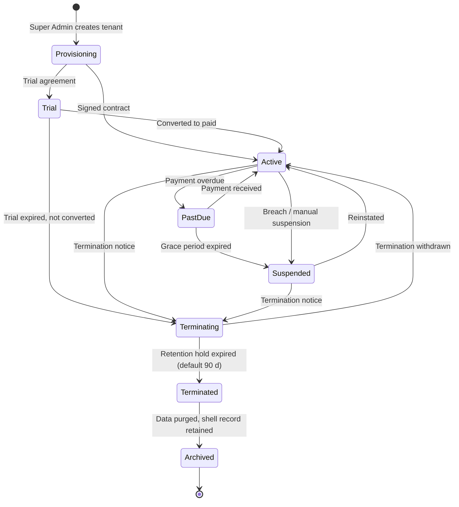

### 1.1 State Behaviour Matrix

| State | Login | Read | Write | API | Notifications | Billing |
|---|---|---|---|---|---|---|
| Provisioning | Super Admin only | — | Setup only | — | Off | Off |
| Trial | All users | Yes | Yes | Yes | On | Off |
| Active | All users | Yes | Yes | Yes | On | On |
| Past Due | All users | Yes | Yes | Yes | On + payment banner | On (overdue) |
| Suspended | Company Admin only | Yes (read-only) | **Blocked** | **Blocked** | Critical only | Held |
| Terminating | Company Admin only | Yes (read-only) | **Blocked** | Export only | Critical only | Final |
| Terminated | **Blocked** | — | — | — | Off | Closed |
| Archived | **Blocked** | — | — | — | Off | Closed |

**Enforcement point.** Tenant status is checked at the `POST /auth/session/exchange` gate (Authentication R1 §5.3 step f) and re-checked on every access-token refresh. Because the access token TTL is 15 minutes, a suspension takes full effect platform-wide within 15 minutes worst case, and immediately for any new session.

---

## 2. WF-01 — Tenant Provisioning

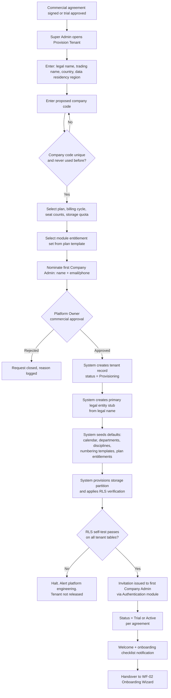

**Rejection / failure paths**

| Failure | Handling |
|---|---|
| Company code collision or previously reserved | Blocked at entry, alternative required |
| RLS self-test failure | Tenant held in Provisioning, engineering alerted, never released to customer |
| Company Admin invitation bounces | Super Admin re-issues with alternate contact; tenant stays in Provisioning past 14 days → auto-flag for review |
| Commercial approval rejected | Provisioning request archived with reason; no tenant created |

**Audit events:** `CMP.TENANT_PROVISION_REQUESTED`, `CMP.TENANT_CREATED`, `CMP.TENANT_STATUS_CHANGED`, `CMP.RLS_SELFTEST_RESULT`

---

## 3. WF-02 — Company Onboarding Wizard

The single most important user experience in the module. Target: **under 60 minutes**, resumable, with nothing mandatory that the customer cannot answer on day one.

```mermaid
flowchart LR
    S1[1. Company Profile] --> S2[2. Primary Legal Entity]
    S2 --> S3[3. Financial Defaults]
    S3 --> S4[4. Branches / Offices]
    S4 --> S5[5. Departments]
    S5 --> S6[6. Disciplines]
    S6 --> S7[7. Working Calendar]
    S7 --> S8[8. Public Holidays]
    S8 --> S9[9. Numbering Scheme]
    S9 --> S10[10. Branding]
    S10 --> S11[11. Invite Core Team]
    S11 --> S12[12. Review & Activate]
    S12 --> DONE[Ready to create first project]
```

### 3.1 Step Detail

| Step | Mandatory | Locks After | Notes |
|---|---|---|---|
| 1. Company Profile | Yes | Company code locks immediately | Trading name, address, contact, timezone, language |
| 2. Primary Legal Entity | Yes | Never (versioned) | Legal name, registration no., TIN, VAT, registered address |
| 3. Financial Defaults | Yes | **Base currency locks on first transaction** | Base currency, reporting currency, fiscal year start |
| 4. Branches | No — head office auto-created | Never | Additional offices can be added anytime |
| 5. Departments | Pre-seeded, editable | Codes lock on first reference | 10 standard construction departments seeded |
| 6. Disciplines | Pre-seeded, editable | **Codes lock on first reference** | ARC, STR, MEP, CIVIL, GEO, BIM seeded |
| 7. Working Calendar | Yes | Effective-dated changes only | Default 6-day week, 08:00–17:00, 1 h break |
| 8. Public Holidays | Yes for current year | Past dates immutable | Country template offered for auto-fill |
| 9. Numbering Scheme | Yes | **Locks permanently once a sequence issues** | Live preview mandatory before save |
| 10. Branding | No | Never | Logo, letterhead, seal; signature blocks deferred |
| 11. Invite Core Team | No | n/a | Hands off to Authentication invitation flow |
| 12. Review & Activate | Yes | n/a | Summary of all locked decisions, explicit confirmation |

### 3.2 Wizard Control Rules

```text
Progress is saved after every step — the wizard is resumable across sessions.
Steps 1, 2, 3, 7, 8, 9 must be complete before the tenant can create a project.
Step 12 presents an irreversibility warning listing:
    - Company code            (permanent)
    - Base currency           (locks on first financial transaction)
    - Discipline codes        (lock on first reference)
    - Numbering patterns      (lock on first issued sequence)
Explicit typed confirmation of the company code is required to proceed.
```

**Audit events:** `CMP.ONBOARDING_STEP_COMPLETED`, `CMP.ONBOARDING_COMPLETED`, `CMP.IMMUTABLE_FIELD_SET`

---

## 4. WF-03 — Legal Entity Registration

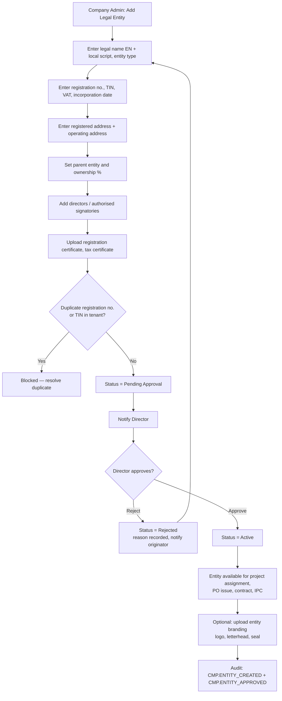

**Why Director approval.** A legal entity is the party that signs contracts and owes tax. Allowing a Company Admin to create one unilaterally means a purchase order can be issued in the name of a company that does not legally exist, or that the group has already dissolved. This is a two-minute approval that prevents a class of problem that takes months to unwind.

**Entity status transitions**

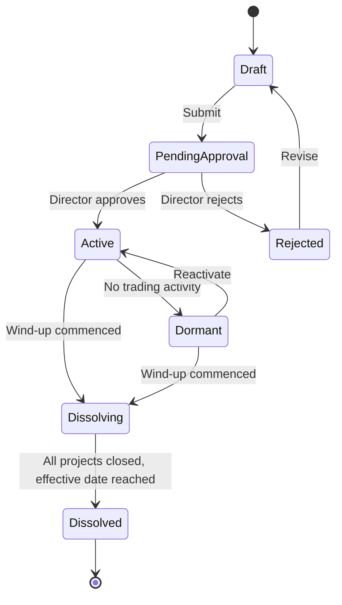

**Guard:** transition to `Dissolving` is blocked while the entity has any Active project, open subcontract, unpaid IPC, or open PO. The system lists the blocking records rather than simply refusing.

---

## 5. WF-04 — Joint Venture Entity Formation

A JV is the single most commonly mishandled entity in construction software. It must be modelled properly or the contract, the IPC, and the tax position all point at the wrong company.

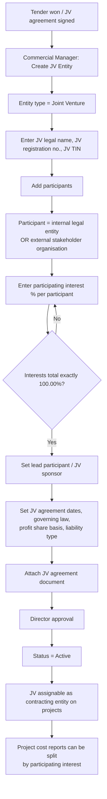

| JV Data Point | Why It Matters Downstream |
|---|---|
| Participating interest % | Drives cost and revenue share reporting; drives each parent's consolidated accounts |
| Lead participant | Determines who signs, who issues transmittals, whose seal appears |
| Liability type (several / joint and several) | Risk register and insurance module input |
| JV TIN | Appears on every JV invoice and IPC — not the parent's TIN |
| JV agreement dates | Drives access expiry for seconded staff (Authentication `access_valid_to`) |

**Guard:** a JV entity cannot be its own parent, cannot participate in itself, and cannot be nested inside another JV.

---

## 6. WF-05 / WF-06 — Branch, Department, and Discipline Setup

```mermaid
flowchart TD
    subgraph Branch
    B1[Add branch] --> B2[Select branch type and legal entity]
    B2 --> B3[Address + GPS coordinates + cost centre code]
    B3 --> B4[Assign branch manager]
    B4 --> B5[Active]
    B5 --> B6{Deactivate requested?}
    B6 -- Yes --> B7{Users or projects<br/>still linked?}
    B7 -- Yes --> B8[Blocked — list linked records,<br/>require reassignment]
    B7 -- No --> B9[Inactive, retained for history]
    end

    subgraph Department
    D1[Add department] --> D2[Code, name, parent department]
    D2 --> D3[Assign department head]
    D3 --> D4[Active]
    D4 --> D5{Deactivate?}
    D5 --> D6{Active users linked?}
    D6 -- Yes --> D7[Blocked — reassign users first]
    D6 -- No --> D8[Inactive]
    end

    subgraph Discipline
    X1[Add discipline] --> X2[Enter code — permanent]
    X2 --> X3[Name, colour, sort order]
    X3 --> X4[Active]
    X4 --> X5{Edit requested?}
    X5 --> X6{Code referenced by<br/>WBS/doc/task/drawing?}
    X6 -- Yes --> X7[Code locked.<br/>Name/colour editable only]
    X6 -- No --> X2
    end
```

**Seeded defaults on provisioning**

| Departments | Disciplines |
|---|---|
| Management, Design, BIM, Planning, Procurement, Construction, QA/QC, HSE, Commercial/QS, HR, Finance, IT | ARC (Architecture), STR (Structural), MEP (Mechanical/Electrical/Plumbing), CIVIL (Civil & Infrastructure), GEO (Geotechnical), BIM (BIM Coordination), LAND (Landscape) |

The customer edits these; they are a starting point, not a constraint. Removing a seeded discipline before it is referenced is permitted and expected.

---

## 7. WF-07 — Working Calendar and Public Holiday Setup

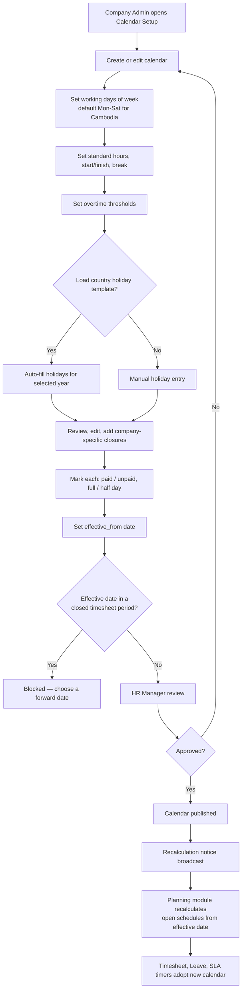

### 7.1 Downstream Consumers — Contract of the Calendar Service

```text
calendar.isWorkingDay(date, calendar_id)            → boolean
calendar.addWorkingDays(date, n, calendar_id)       → date
calendar.workingDaysBetween(from, to, calendar_id)  → int
calendar.workingHoursBetween(from, to, calendar_id) → decimal
calendar.nextWorkingMoment(datetime, calendar_id)   → datetime
```

| Consumer | Use |
|---|---|
| Planning & Scheduling | Task duration, finish date, total float, free float, critical path |
| Task Engine | Due date calculation, overdue flag |
| Timesheet | Expected hours, overtime threshold, absence detection |
| Leave | Leave day deduction excluding holidays |
| Notification Engine | Escalation timers ("2 working days") |
| Approval Workflow | SLA breach detection |
| Claims / EOT | Time impact analysis working-day basis |

**Architectural rule.** No module implements its own date arithmetic or holds a private holiday list. All of the above call the calendar service. This is a code-review gate, not a suggestion — the single most common cause of "the system says 12 days, my programme says 14" is two modules disagreeing about Pchum Ben.

### 7.2 Multi-Calendar Pattern

```text
Calendar: OFFICE  → Mon–Fri, 08:00–17:00   → used by Design, Finance, HR
Calendar: SITE    → Mon–Sat, 07:00–17:00   → used by Construction, QA/QC, HSE
Calendar: SHUTDOWN overlay → project-specific closure ranges
                              (Khmer New Year site closure, monsoon suspension)

Resolution order for a task:
    project calendar override → discipline calendar → company default calendar
```

---

## 8. WF-08 — Numbering Scheme Definition

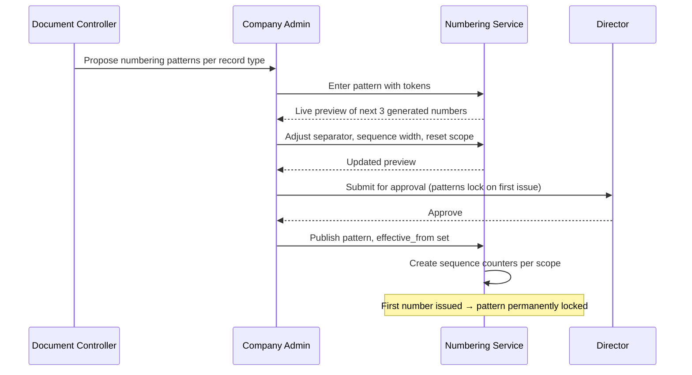

### 8.1 Token Set and Example Patterns

| Token | Resolves To |
|---|---|
| `{COMPANY}` | Company code (e.g. `ACC`) |
| `{PROJECT}` | Project code (e.g. `P001`) |
| `{ENTITY}` | Legal entity short code |
| `{DISCIPLINE}` | Discipline code (`STR`) |
| `{TYPE}` | Record type code (`DWG`, `RFI`, `PO`) |
| `{BUILDING}` `{LEVEL}` `{ZONE}` | WBS segments |
| `{YEAR}` `{YY}` `{MM}` | Date parts at issue |
| `{SEQ:n}` | Zero-padded sequence of width n |
| `{REV:n}` | Revision suffix |

| Record | Example Pattern | Rendered |
|---|---|---|
| Project | `{COMPANY}-{SEQ:3}` | `ACC-001` |
| Drawing | `{PROJECT}-{DISCIPLINE}-DWG-{BUILDING}-{LEVEL}-{SEQ:3}-R{REV:2}` | `P001-STR-DWG-B01-L05-001-R02` |
| RFI | `{PROJECT}-RFI-{SEQ:4}` | `P001-RFI-0087` |
| Purchase Order | `{ENTITY}-PO-{YY}-{SEQ:4}` | `ACCM-PO-26-0142` |
| IPC | `{PROJECT}-IPC-{SEQ:2}` | `P001-IPC-14` |
| Transmittal | `{PROJECT}-TRN-{YY}{MM}-{SEQ:3}` | `P001-TRN-2608-021` |

### 8.2 Sequence Integrity Rules

```text
Sequence scope options: GLOBAL | PER_COMPANY | PER_ENTITY | PER_PROJECT
                        | PER_PROJECT_DISCIPLINE | PER_PROJECT_YEAR

Allocation is atomic  → SELECT ... FOR UPDATE on the counter row
Numbers are gap-free  → allocated only on successful record commit
Voided records        → number permanently consumed, never reissued
Reset behaviour       → yearly reset permitted only where {YEAR} or {YY} is in the pattern
```

**Failure path.** If a record creation transaction rolls back after allocation, the allocated number is written to a `voided_sequence` log rather than returned to the pool. A gap in a document register invites an auditor's question; a duplicated document number invites a dispute. The gap is the safer failure.

---

## 9. WF-09 — Branding and Signature Blocks

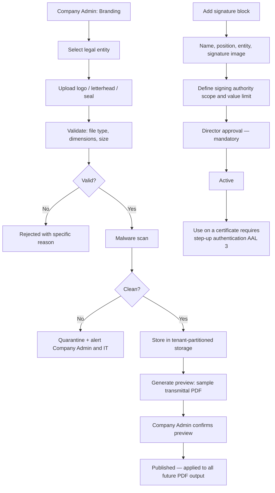

**Rule.** A signature image is a legal instrument. It is uploaded by an admin but authorised by a Director, its use is restricted by RBAC, and every application of it to a document requires step-up authentication and records the assertion id on the output record — mirroring Authentication R1 §6.2.

---

## 10. WF-10 / WF-11 — Subscription and Entitlement Change

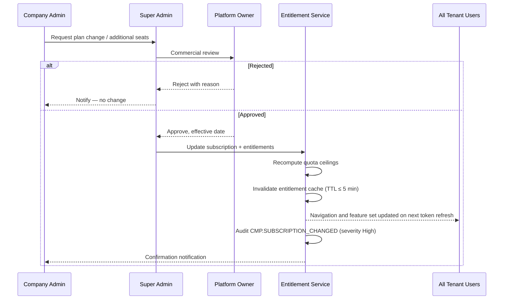

### 10.1 Downgrade Guard

A downgrade cannot silently break the tenant. Before applying:

```text
IF new seat cap < current active users of that class
    → BLOCK. List the users. Require deactivation first.
IF new storage quota < current usage
    → BLOCK. Require cleanup or archive first.
IF module being disabled has live records
    → WARN with record counts.
    → If confirmed: module hidden and API-blocked, data RETAINED, never deleted.
    → Re-enabling restores full access to the retained data.
```

**Rule:** disabling a module never deletes data. A customer who drops the Equipment module for a quarter and re-enables it must find their equipment register intact.

---

## 11. WF-12 — Quota Monitoring and Enforcement (Automated)

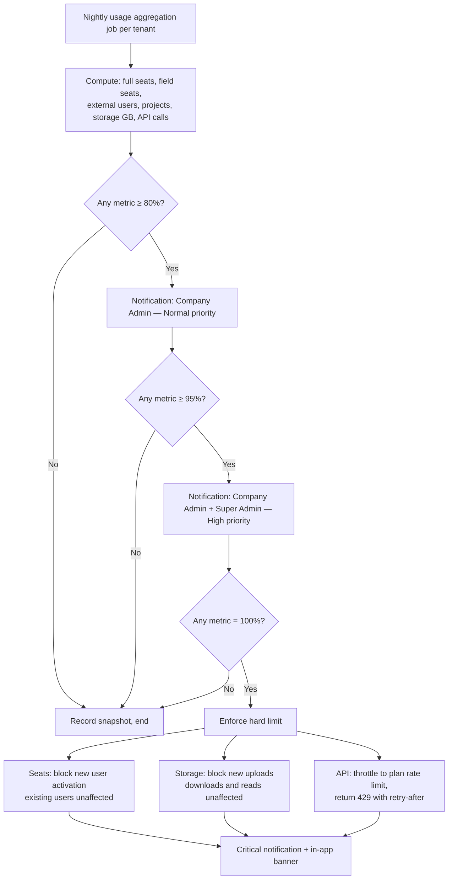

**Never do this:** deactivate users, delete files, or block logins to enforce a quota. The customer is mid-project. Block the *growth*, never the *access*.

---

## 12. WF-13 — Suspension and Reactivation

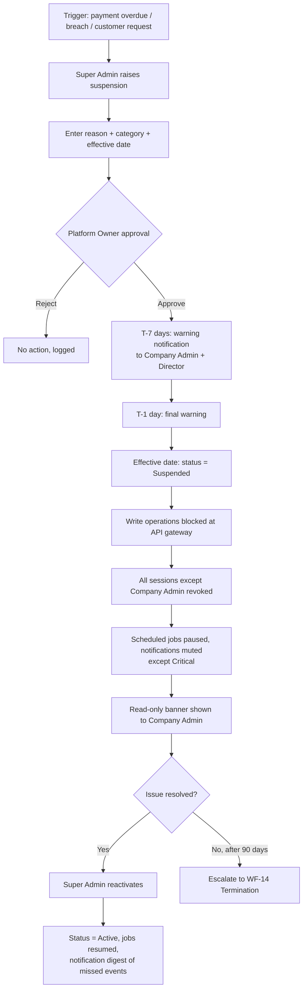

**Data guarantee during suspension:** nothing is deleted, nothing is archived, no file is moved to cold storage. Suspension is a commercial lever, not a data event.

---

## 13. WF-14 — Termination, Export, and Archive

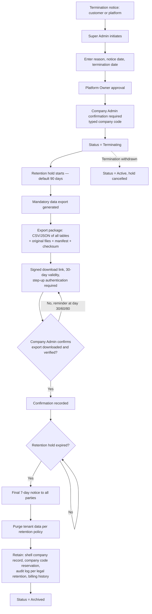

### 13.1 What Survives a Purge

| Retained | Reason | Retention |
|---|---|---|
| Shell company record (code, name, dates) | Company code must never be reissued | Permanent |
| Audit log (authentication + company events) | Legal and contractual traceability | 7 years min. |
| Financial transaction summary | Statutory accounting obligation | 7–10 years |
| Billing and subscription history | Commercial dispute resolution | 7 years |
| Purged | Project data, documents, drawings, photos, BIM models, tasks, personal data | — |

Aligned with Gap Analysis R1 §5.1 (Data Archiving and Retention Policy) and Authentication R1 §7.9 (append-only auth audit, 7-year minimum).

---

## 14. WF-15 — Super Admin Impersonation (Break-Glass)

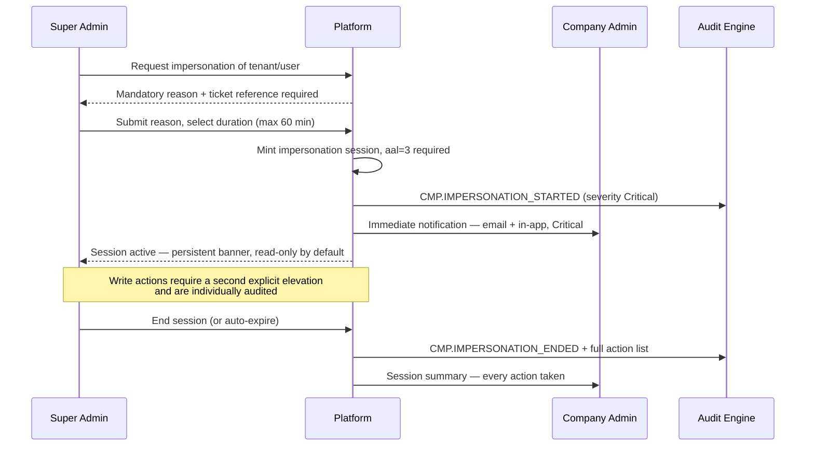

Directly closes Gap Analysis R1 §5.2: *"Super Admin access to tenant data requires explicit impersonation with audit log entry."* The addition here is the **read-only default** and the **action summary to the customer** — the customer must be able to see exactly what the vendor did inside their account.

---

## 15. WF-16 — Entity Deactivation and Group Restructure

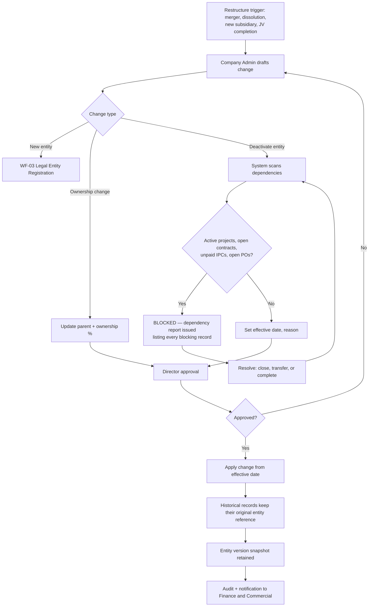

**The critical rule.** A restructure changes the *future*. A purchase order issued in 2026 by "ACC Construction Co., Ltd" still shows that name, that TIN, and that address in 2033 when the claim is heard — even if the entity was renamed or dissolved in 2028. This is what entity versioning exists for.

---

## 16. Consolidated Notification Map

| Event | Recipients | Priority | Channel |
|---|---|---|---|
| Tenant provisioned | Super Admin, first Company Admin | Normal | Email |
| Onboarding incomplete after 14 days | Company Admin, Super Admin | Normal | Email + In-app |
| Legal entity pending approval | Director | High | In-app + Email |
| Legal entity approved / rejected | Originator, Finance | Normal | In-app |
| JV entity created | Director, Finance, Commercial | High | In-app + Email |
| Calendar change published | All users, Planning Manager, HR | Normal | In-app + digest |
| Numbering pattern locked | Company Admin, Document Controller | High | In-app + Email |
| Signature block added / used | Director, Company Admin | High | In-app + Email |
| Quota 80% / 95% | Company Admin | Normal / High | In-app + Email |
| Quota 100% — enforcement active | Company Admin, Super Admin | Critical | In-app + Email + banner |
| Subscription changed | Company Admin, Director | High | Email |
| Module disabled | Company Admin, all affected users | High | In-app + Email |
| Suspension warning T-7 / T-1 | Company Admin, Director | High / Critical | Email + In-app |
| Tenant suspended | Company Admin, Director, Super Admin | Critical | Email |
| Termination initiated | Company Admin, Director, Platform Owner | Critical | Email |
| Data export ready | Requester, Company Admin | High | Email (signed link) |
| Impersonation started / ended | Company Admin, Director | Critical | Email + In-app |
| Restricted field unmasked | Company Admin (daily digest) | Normal | In-app digest |

Per Notification Engine anti-spam rules (R0 §24.5.12): quota warnings and expiry notices batch into a single daily digest per recipient; Critical events bypass digest and send immediately.

---

## 17. Consolidated Audit Events

| Event Code | Severity | Logged Data |
|---|---|---|
| `CMP.TENANT_PROVISION_REQUESTED` | High | Requester, plan, seats, region |
| `CMP.TENANT_CREATED` | Critical | Company code, entity, region, actor |
| `CMP.TENANT_STATUS_CHANGED` | Critical | From, to, reason, effective date, actor |
| `CMP.RLS_SELFTEST_RESULT` | Critical | Pass/fail, tables tested |
| `CMP.PROFILE_UPDATED` | Medium | Field, old, new |
| `CMP.IMMUTABLE_FIELD_SET` | High | Field, value, actor |
| `CMP.ENTITY_CREATED` / `_APPROVED` / `_REJECTED` | High | Entity, approver, reason |
| `CMP.ENTITY_UPDATED` / `_DEACTIVATED` / `_DISSOLVED` | High | Old/new values, effective date |
| `CMP.JV_CREATED` / `_INTEREST_CHANGED` | High | Participants, percentages |
| `CMP.BRANCH_*` / `CMP.DEPARTMENT_*` / `CMP.DISCIPLINE_*` | Medium | Record, action, actor |
| `CMP.CALENDAR_PUBLISHED` | High | Calendar, effective date, holiday count |
| `CMP.HOLIDAY_ADDED` / `_REMOVED` | Medium | Date, name |
| `CMP.NUMBERING_PATTERN_PUBLISHED` / `_LOCKED` | High | Record type, pattern |
| `CMP.SEQUENCE_VOIDED` | Medium | Number, reason |
| `CMP.BRANDING_UPDATED` | Medium | Asset type, entity |
| `CMP.SIGNATURE_BLOCK_CREATED` / `_USED` | Critical | Signatory, document, step-up assertion id |
| `CMP.SUBSCRIPTION_CHANGED` | High | Old plan, new plan, seats, effective date |
| `CMP.MODULE_ENTITLEMENT_CHANGED` | High | Module, enabled/disabled, actor |
| `CMP.QUOTA_THRESHOLD_REACHED` | Medium/High | Metric, percentage |
| `CMP.QUOTA_ENFORCEMENT_ACTIVATED` | Critical | Metric, action taken |
| `CMP.RESTRICTED_FIELD_UNMASKED` | High | Field, record, actor |
| `CMP.DATA_EXPORT_REQUESTED` / `_DOWNLOADED` | Critical | Scope, actor, step-up assertion |
| `CMP.IMPERSONATION_STARTED` / `_ENDED` | Critical | Admin, tenant, reason, action list |
| `CMP.TENANT_PURGED` | Critical | Scope, retained categories, actor |

All events conform to the Audit Trail Engine schema in R0 §24.4.5, carrying `old_values` / `new_values` and `correlation_id`.

---

*Digital Construction Operating System — Foundation — Module 01 Company / Tenant Setup — Document 03 Workflow Diagram — Internal Controlled Document*
