# DCOS — Module 01 Company / Tenant Setup
## Document 04 — Database Schema

**Digital Construction Operating System — Foundation Layer**

| Field | Value |
|---|---|
| Document Code | DCOS-CMP-04-DB |
| Module | 01 — Company / Tenant Setup (`CMP`) |
| Version | R1 — Initial Issue |
| Database | PostgreSQL 15+ / Supabase |
| Schema | `core` (shared platform schema) |
| Source | Auto — generated from migrations, reconciled to this specification |
| Parent Documents | DCOS-CMP-01-BR · DCOS-CMP-03-WF |
| ERD Group | **Group A — Security & Tenant** (extends R0 §31 Group A) |
| Classification | Internal — Strategic Architecture |
| Status | For Development |

---

## 1. Design Decisions

| # | Decision | Rationale |
|---|---|---|
| DB-01 | **Tenant key is `company_id`** on every tenant-scoped table | Matches R0 §24.4.5, R0 §31 Group A, and Authentication R1 `tid` claim. One key, one RLS predicate, no ambiguity. |
| DB-02 | **Tenant ≠ legal entity.** `company` is the tenant root; `legal_entity` is a dimension inside it | Construction groups run many registered entities. Making each a tenant would fragment projects, users, and reporting across accounts that must be consolidated. |
| DB-03 | Every tenant-scoped table has `company_id uuid NOT NULL` with RLS enabled — **no exceptions** | Gap Analysis R1 §5.2. Enforced by a CI check that fails the build on any table lacking a policy. |
| DB-04 | Platform-global tables (`subscription_plan`, `country`, `currency`, `holiday_template`) live in `core` **without** `company_id` and are read-only to tenants | Shared reference data must not be duplicated per tenant. |
| DB-05 | **Soft lifecycle, never hard delete.** Status columns and `deactivated_at`; no `DELETE` grants on tenant tables | R0 §24.4.13 — deleting a business record must not orphan its audit trail. |
| DB-06 | **Entity versioning** via `legal_entity_version` snapshot rows | A document issued in 2026 must render 2026 entity details in 2033. |
| DB-07 | `ULID`-style text codes for human-facing identifiers, `uuid` for keys | Keys are opaque; codes are readable and appear in document numbers. |
| DB-08 | All timestamps `timestamptz`, stored UTC, rendered in company timezone | Multi-country tenants; audit correctness. |
| DB-09 | Monetary values `numeric(18,4)`; percentages `numeric(7,4)` | Never floating point for money or interest shares. |
| DB-10 | Sequence allocation via a dedicated counter table with `SELECT … FOR UPDATE` | Gap-free, concurrency-safe, no reliance on Postgres sequences (which are not gap-free on rollback). |
| DB-11 | Restricted columns (TIN, VAT, bank account) are stored plainly but **masked at the API layer**; access requires permission and is audited | Field-level encryption deferred to Phase 2; masking + audit is the P1 control. |
| DB-12 | Storage paths are tenant-partitioned: `tenant/{company_id}/…` | No shared bucket prefixes — Gap Analysis R1 §5.2. |

---

## 2. Entity Relationship Diagram

```mermaid
erDiagram
    COMPANY ||--o{ LEGAL_ENTITY : "registers"
    COMPANY ||--|| COMPANY_SETTING : "has"
    COMPANY ||--o{ COMPANY_BRANCH : "operates"
    COMPANY ||--o{ COMPANY_DEPARTMENT : "organises"
    COMPANY ||--o{ COMPANY_DISCIPLINE : "defines"
    COMPANY ||--o{ COMPANY_CALENDAR : "maintains"
    COMPANY ||--o{ NUMBERING_RULE : "configures"
    COMPANY ||--|| COMPANY_SUBSCRIPTION : "holds"
    COMPANY ||--o{ COMPANY_MODULE_ENTITLEMENT : "entitled to"
    COMPANY ||--o{ COMPANY_QUOTA_USAGE : "consumes"
    COMPANY ||--o{ COMPANY_LIFECYCLE_EVENT : "transitions"
    COMPANY ||--o{ DATA_EXPORT_REQUEST : "requests"

    LEGAL_ENTITY ||--o{ LEGAL_ENTITY_VERSION : "snapshots"
    LEGAL_ENTITY ||--o{ LEGAL_ENTITY_RELATIONSHIP : "parent of"
    LEGAL_ENTITY ||--o{ JV_PARTICIPANT : "composed of"
    LEGAL_ENTITY ||--o{ ENTITY_SIGNATORY : "authorises"
    LEGAL_ENTITY ||--o{ COMPANY_BANK_ACCOUNT : "banks with"
    LEGAL_ENTITY ||--o{ ENTITY_BRANDING : "branded by"
    LEGAL_ENTITY ||--o{ COMPANY_BRANCH : "operates from"

    COMPANY_CALENDAR ||--o{ CALENDAR_HOLIDAY : "excludes"
    COMPANY_CALENDAR ||--o{ CALENDAR_WORKING_PATTERN : "defines"

    NUMBERING_RULE ||--o{ NUMBERING_SEQUENCE : "counts"
    NUMBERING_SEQUENCE ||--o{ VOIDED_SEQUENCE : "voids"

    SUBSCRIPTION_PLAN ||--o{ COMPANY_SUBSCRIPTION : "priced by"
    SUBSCRIPTION_PLAN ||--o{ PLAN_MODULE_ENTITLEMENT : "includes"
    COMPANY_SUBSCRIPTION ||--o{ SUBSCRIPTION_HISTORY : "changes"

    COMPANY_DEPARTMENT ||--o{ COMPANY_DEPARTMENT : "parent of"
```



**External references (owned by other modules, shown for context)**

```text
app_user, user_company_membership, tenant_auth_policy   → 03-01 Authentication
role, permission                                        → 03-02 RBAC
project                                                 → Project Setup (project.contracting_entity_id → legal_entity)
employee                                                → HR Module (employee.employing_entity_id → legal_entity)
stakeholder                                             → Stakeholder Management (jv_participant.external_stakeholder_id)
audit_log                                               → Audit Trail Engine
```

---

## 3. Enumerated Types

```sql
CREATE TYPE core.company_status AS ENUM (
  'provisioning', 'trial', 'active', 'past_due',
  'suspended', 'terminating', 'terminated', 'archived'
);

CREATE TYPE core.legal_entity_type AS ENUM (
  'holding', 'operating', 'subsidiary', 'joint_venture',
  'spv', 'branch_entity', 'representative_office'
);

CREATE TYPE core.legal_entity_status AS ENUM (
  'draft', 'pending_approval', 'active', 'rejected',
  'dormant', 'dissolving', 'dissolved'
);

CREATE TYPE core.branch_type AS ENUM (
  'head_office', 'regional_office', 'project_office',
  'site_office', 'yard', 'workshop', 'warehouse'
);

CREATE TYPE core.record_status AS ENUM ('active', 'inactive', 'archived');

CREATE TYPE core.billing_cycle AS ENUM ('monthly', 'quarterly', 'annual');

CREATE TYPE core.seat_class AS ENUM ('full', 'field', 'external', 'viewer');

CREATE TYPE core.quota_metric AS ENUM (
  'full_seats', 'field_seats', 'external_seats',
  'projects', 'storage_gb', 'api_calls_month'
);

CREATE TYPE core.sequence_scope AS ENUM (
  'global', 'per_company', 'per_entity', 'per_project',
  'per_project_discipline', 'per_project_year', 'per_entity_year'
);

CREATE TYPE core.jv_liability_type AS ENUM ('several', 'joint_and_several');

CREATE TYPE core.export_status AS ENUM (
  'requested', 'generating', 'ready', 'downloaded', 'expired', 'failed'
);

CREATE TYPE core.data_residency AS ENUM (
  'ap_southeast', 'ap_northeast', 'eu_west', 'us_east'
);
```

---

## 4. Table Definitions

### 4.1 `core.company` — Tenant Root

The single most important table in DCOS. Every other tenant-scoped row points at it.

```sql
CREATE TABLE core.company (
  company_id            uuid PRIMARY KEY DEFAULT gen_random_uuid(),
  company_code          varchar(6)  NOT NULL UNIQUE,
  trading_name          varchar(200) NOT NULL,
  legal_name            varchar(200) NOT NULL,
  status                core.company_status NOT NULL DEFAULT 'provisioning',

  -- Locale & platform defaults
  country_code          char(2)     NOT NULL,
  data_residency        core.data_residency NOT NULL,
  default_timezone      varchar(64) NOT NULL DEFAULT 'Asia/Phnom_Penh',
  default_language      varchar(8)  NOT NULL DEFAULT 'en',
  date_format           varchar(20) NOT NULL DEFAULT 'DD-MMM-YYYY',
  number_format         varchar(20) NOT NULL DEFAULT '1,234.56',
  unit_system           varchar(10) NOT NULL DEFAULT 'metric',

  -- Financial defaults
  base_currency         char(3)     NOT NULL,
  reporting_currency    char(3)     NOT NULL,
  fiscal_year_start_month smallint  NOT NULL DEFAULT 1,
  base_currency_locked  boolean     NOT NULL DEFAULT false,

  -- Contact
  head_office_address   jsonb,
  primary_contact_name  varchar(150),
  primary_contact_email citext,
  primary_contact_phone varchar(30),
  website               varchar(200),
  logo_url              text,

  -- Defaults set at provisioning
  primary_entity_id     uuid,       -- FK added after legal_entity exists
  default_calendar_id   uuid,
  industry_classification varchar(100),

  -- Onboarding
  onboarding_completed  boolean     NOT NULL DEFAULT false,
  onboarding_step       smallint    NOT NULL DEFAULT 1,
  activated_at          timestamptz,

  -- Audit
  created_by            uuid,
  created_at            timestamptz NOT NULL DEFAULT now(),
  updated_by            uuid,
  updated_at            timestamptz NOT NULL DEFAULT now(),
  suspended_at          timestamptz,
  terminated_at         timestamptz,
  archived_at           timestamptz,

  CONSTRAINT company_code_format CHECK (company_code ~ '^[A-Z0-9]{3,6}$'),
  CONSTRAINT fiscal_month_valid  CHECK (fiscal_year_start_month BETWEEN 1 AND 12),
  CONSTRAINT unit_system_valid   CHECK (unit_system IN ('metric','imperial'))
);

CREATE INDEX idx_company_status ON core.company(status);
CREATE UNIQUE INDEX idx_company_code ON core.company(upper(company_code));

COMMENT ON COLUMN core.company.company_code IS
  'IMMUTABLE. Root segment of every project and document number. Never reused, even after termination.';
COMMENT ON COLUMN core.company.base_currency_locked IS
  'Set true by the first financial transaction. Once true, base_currency is immutable.';
```

**Immutability trigger**

```sql
CREATE OR REPLACE FUNCTION core.fn_company_immutability()
RETURNS trigger LANGUAGE plpgsql AS $$
BEGIN
  IF NEW.company_code IS DISTINCT FROM OLD.company_code THEN
    RAISE EXCEPTION 'CMP_E001: company_code is immutable';
  END IF;
  IF OLD.base_currency_locked
     AND NEW.base_currency IS DISTINCT FROM OLD.base_currency THEN
    RAISE EXCEPTION 'CMP_E002: base_currency is locked by existing transactions';
  END IF;
  IF NEW.data_residency IS DISTINCT FROM OLD.data_residency THEN
    RAISE EXCEPTION 'CMP_E003: data_residency requires a formal migration process';
  END IF;
  NEW.updated_at := now();
  RETURN NEW;
END $$;

CREATE TRIGGER trg_company_immutability
  BEFORE UPDATE ON core.company
  FOR EACH ROW EXECUTE FUNCTION core.fn_company_immutability();
```

---

### 4.2 `core.legal_entity`

```sql
CREATE TABLE core.legal_entity (
  legal_entity_id       uuid PRIMARY KEY DEFAULT gen_random_uuid(),
  company_id            uuid NOT NULL REFERENCES core.company(company_id),
  entity_code           varchar(10) NOT NULL,
  legal_name            varchar(200) NOT NULL,
  legal_name_local      varchar(200),            -- Khmer / local script
  trading_name          varchar(200),
  entity_type           core.legal_entity_type NOT NULL,
  status                core.legal_entity_status NOT NULL DEFAULT 'draft',
  is_primary            boolean NOT NULL DEFAULT false,

  -- Statutory (RESTRICTED — masked at API layer)
  registration_number   varchar(60),
  tax_identification_no varchar(60),
  vat_registration_no   varchar(60),
  incorporation_date    date,
  country_of_registration char(2) NOT NULL,

  -- Addresses
  registered_address    jsonb,
  operating_address     jsonb,
  contact_email         citext,
  contact_phone         varchar(30),

  -- Group structure
  parent_entity_id      uuid REFERENCES core.legal_entity(legal_entity_id),
  ownership_percent     numeric(7,4),

  -- JV specifics (null for non-JV)
  jv_agreement_date     date,
  jv_expiry_date        date,
  jv_lead_participant_id uuid,
  jv_liability_type     core.jv_liability_type,
  jv_governing_law      varchar(100),

  -- Lifecycle
  approved_by           uuid,
  approved_at           timestamptz,
  rejection_reason      text,
  dormant_from          date,
  dissolved_date        date,
  deactivation_reason   text,

  created_by            uuid,
  created_at            timestamptz NOT NULL DEFAULT now(),
  updated_by            uuid,
  updated_at            timestamptz NOT NULL DEFAULT now(),

  CONSTRAINT uq_entity_code        UNIQUE (company_id, entity_code),
  CONSTRAINT uq_entity_reg_no      UNIQUE (company_id, registration_number),
  CONSTRAINT chk_ownership_pct     CHECK (ownership_percent IS NULL
                                          OR ownership_percent BETWEEN 0 AND 100),
  CONSTRAINT chk_not_own_parent    CHECK (parent_entity_id IS DISTINCT FROM legal_entity_id),
  CONSTRAINT chk_jv_fields         CHECK (
      entity_type <> 'joint_venture'
      OR (jv_agreement_date IS NOT NULL AND jv_liability_type IS NOT NULL))
);

-- Exactly one primary entity per tenant
CREATE UNIQUE INDEX uq_one_primary_entity
  ON core.legal_entity(company_id)
  WHERE is_primary = true;

CREATE INDEX idx_entity_company_status ON core.legal_entity(company_id, status);
CREATE INDEX idx_entity_parent         ON core.legal_entity(parent_entity_id);

ALTER TABLE core.company
  ADD CONSTRAINT fk_company_primary_entity
  FOREIGN KEY (primary_entity_id) REFERENCES core.legal_entity(legal_entity_id);
```

---

### 4.3 `core.legal_entity_version` — Point-in-Time Snapshot

```sql
CREATE TABLE core.legal_entity_version (
  version_id            uuid PRIMARY KEY DEFAULT gen_random_uuid(),
  company_id            uuid NOT NULL REFERENCES core.company(company_id),
  legal_entity_id       uuid NOT NULL REFERENCES core.legal_entity(legal_entity_id),
  version_no            integer NOT NULL,
  valid_from            timestamptz NOT NULL,
  valid_to              timestamptz,                -- null = current
  snapshot              jsonb NOT NULL,             -- full entity row at this time
  change_reason         text,
  changed_by            uuid,
  created_at            timestamptz NOT NULL DEFAULT now(),

  CONSTRAINT uq_entity_version UNIQUE (legal_entity_id, version_no)
);

CREATE INDEX idx_entity_version_lookup
  ON core.legal_entity_version(legal_entity_id, valid_from DESC);
```

**Resolution function used by document rendering**

```sql
CREATE OR REPLACE FUNCTION core.fn_entity_as_of(
  p_entity_id uuid, p_as_of timestamptz)
RETURNS jsonb LANGUAGE sql STABLE AS $$
  SELECT snapshot
  FROM core.legal_entity_version
  WHERE legal_entity_id = p_entity_id
    AND valid_from <= p_as_of
    AND (valid_to IS NULL OR valid_to > p_as_of)
  ORDER BY valid_from DESC
  LIMIT 1;
$$;
```

Every PDF generator (transmittal, PO, subcontract, IPC) calls this with the record's issue date, never the current entity row.

---

### 4.4 `core.jv_participant`

```sql
CREATE TABLE core.jv_participant (
  participant_id        uuid PRIMARY KEY DEFAULT gen_random_uuid(),
  company_id            uuid NOT NULL REFERENCES core.company(company_id),
  jv_entity_id          uuid NOT NULL REFERENCES core.legal_entity(legal_entity_id),
  internal_entity_id    uuid REFERENCES core.legal_entity(legal_entity_id),
  external_stakeholder_id uuid,          -- → stakeholder (Stakeholder Management)
  participant_name      varchar(200) NOT NULL,
  participating_interest numeric(7,4) NOT NULL,
  is_lead               boolean NOT NULL DEFAULT false,
  role_in_jv            varchar(100),
  created_at            timestamptz NOT NULL DEFAULT now(),

  CONSTRAINT chk_participant_ref CHECK (
    (internal_entity_id IS NOT NULL) <> (external_stakeholder_id IS NOT NULL)),
  CONSTRAINT chk_interest_range  CHECK (participating_interest > 0
                                        AND participating_interest <= 100),
  CONSTRAINT chk_jv_not_self     CHECK (internal_entity_id IS DISTINCT FROM jv_entity_id)
);

CREATE UNIQUE INDEX uq_jv_lead ON core.jv_participant(jv_entity_id)
  WHERE is_lead = true;
```

**100% constraint (deferred check on commit)**

```sql
CREATE OR REPLACE FUNCTION core.fn_jv_interest_total()
RETURNS trigger LANGUAGE plpgsql AS $$
DECLARE v_total numeric(9,4);
BEGIN
  SELECT COALESCE(SUM(participating_interest),0) INTO v_total
  FROM core.jv_participant
  WHERE jv_entity_id = COALESCE(NEW.jv_entity_id, OLD.jv_entity_id);

  IF v_total <> 100.0000 THEN
    RAISE EXCEPTION
      'CMP_E010: JV participating interests total %, must equal 100.0000', v_total;
  END IF;
  RETURN NULL;
END $$;

CREATE CONSTRAINT TRIGGER trg_jv_interest_total
  AFTER INSERT OR UPDATE OR DELETE ON core.jv_participant
  DEFERRABLE INITIALLY DEFERRED
  FOR EACH ROW EXECUTE FUNCTION core.fn_jv_interest_total();
```

---

### 4.5 `core.entity_signatory`

```sql
CREATE TABLE core.entity_signatory (
  signatory_id          uuid PRIMARY KEY DEFAULT gen_random_uuid(),
  company_id            uuid NOT NULL REFERENCES core.company(company_id),
  legal_entity_id       uuid NOT NULL REFERENCES core.legal_entity(legal_entity_id),
  user_id               uuid,                      -- → app_user (Authentication)
  full_name             varchar(150) NOT NULL,
  position_title        varchar(150) NOT NULL,
  signature_image_url   text,
  authority_scope       text[],   -- {'PO','SUBCONTRACT','IPC','TRANSMITTAL','CERTIFICATE'}
  value_limit           numeric(18,4),
  value_limit_currency  char(3),
  valid_from            date NOT NULL,
  valid_to              date,
  approved_by           uuid NOT NULL,
  approved_at           timestamptz NOT NULL,
  status                core.record_status NOT NULL DEFAULT 'active',
  created_at            timestamptz NOT NULL DEFAULT now()
);

CREATE INDEX idx_signatory_entity ON core.entity_signatory(legal_entity_id, status);
```

> **Note.** `value_limit` here is *documentary* — the name and limit that print on a contract. The enforceable approval threshold lives in the RBAC / Delegation of Authority matrix (Module 03-02). Two different things; do not let one drive the other silently.

---

### 4.6 `core.company_branch`

```sql
CREATE TABLE core.company_branch (
  branch_id             uuid PRIMARY KEY DEFAULT gen_random_uuid(),
  company_id            uuid NOT NULL REFERENCES core.company(company_id),
  legal_entity_id       uuid REFERENCES core.legal_entity(legal_entity_id),
  branch_code           varchar(20) NOT NULL,
  branch_name           varchar(150) NOT NULL,
  branch_type           core.branch_type NOT NULL,
  address               jsonb,
  latitude              numeric(10,7),
  longitude             numeric(10,7),
  phone                 varchar(30),
  email                 citext,
  branch_manager_id     uuid,                      -- → app_user
  cost_centre_code      varchar(30),
  project_id            uuid,                      -- for site/project offices
  is_head_office        boolean NOT NULL DEFAULT false,
  status                core.record_status NOT NULL DEFAULT 'active',
  opened_date           date,
  closed_date           date,
  created_at            timestamptz NOT NULL DEFAULT now(),
  updated_at            timestamptz NOT NULL DEFAULT now(),

  CONSTRAINT uq_branch_code UNIQUE (company_id, branch_code)
);

CREATE UNIQUE INDEX uq_one_head_office ON core.company_branch(company_id)
  WHERE is_head_office = true AND status = 'active';
CREATE INDEX idx_branch_company ON core.company_branch(company_id, status);
```

---

### 4.7 `core.company_department`

```sql
CREATE TABLE core.company_department (
  department_id         uuid PRIMARY KEY DEFAULT gen_random_uuid(),
  company_id            uuid NOT NULL REFERENCES core.company(company_id),
  department_code       varchar(20) NOT NULL,
  department_name       varchar(150) NOT NULL,
  parent_department_id  uuid REFERENCES core.company_department(department_id),
  department_head_id    uuid,                      -- → app_user
  branch_id             uuid REFERENCES core.company_branch(branch_id),
  cost_centre_code      varchar(30),
  sort_order            integer NOT NULL DEFAULT 0,
  status                core.record_status NOT NULL DEFAULT 'active',
  created_at            timestamptz NOT NULL DEFAULT now(),
  updated_at            timestamptz NOT NULL DEFAULT now(),

  CONSTRAINT uq_department_code UNIQUE (company_id, department_code),
  CONSTRAINT chk_dept_not_own_parent
    CHECK (parent_department_id IS DISTINCT FROM department_id)
);

CREATE INDEX idx_department_company ON core.company_department(company_id, status);
CREATE INDEX idx_department_parent  ON core.company_department(parent_department_id);
```

---

### 4.8 `core.company_discipline`

```sql
CREATE TABLE core.company_discipline (
  discipline_id         uuid PRIMARY KEY DEFAULT gen_random_uuid(),
  company_id            uuid NOT NULL REFERENCES core.company(company_id),
  discipline_code       varchar(10) NOT NULL,      -- IMMUTABLE once referenced
  discipline_name       varchar(100) NOT NULL,
  description           text,
  colour_hex            char(7),
  sort_order            integer NOT NULL DEFAULT 0,
  is_design_discipline  boolean NOT NULL DEFAULT true,
  is_referenced         boolean NOT NULL DEFAULT false,   -- set on first use
  status                core.record_status NOT NULL DEFAULT 'active',
  created_at            timestamptz NOT NULL DEFAULT now(),
  updated_at            timestamptz NOT NULL DEFAULT now(),

  CONSTRAINT uq_discipline_code   UNIQUE (company_id, discipline_code),
  CONSTRAINT chk_discipline_fmt   CHECK (discipline_code ~ '^[A-Z]{2,10}$'),
  CONSTRAINT chk_colour_hex       CHECK (colour_hex IS NULL OR colour_hex ~ '^#[0-9A-Fa-f]{6}$')
);
```

```sql
CREATE OR REPLACE FUNCTION core.fn_discipline_code_lock()
RETURNS trigger LANGUAGE plpgsql AS $$
BEGIN
  IF OLD.is_referenced
     AND NEW.discipline_code IS DISTINCT FROM OLD.discipline_code THEN
    RAISE EXCEPTION
      'CMP_E020: discipline_code % is locked — already referenced by project records',
      OLD.discipline_code;
  END IF;
  RETURN NEW;
END $$;

CREATE TRIGGER trg_discipline_code_lock
  BEFORE UPDATE ON core.company_discipline
  FOR EACH ROW EXECUTE FUNCTION core.fn_discipline_code_lock();
```

---

### 4.9 Calendar Tables

```sql
CREATE TABLE core.company_calendar (
  calendar_id           uuid PRIMARY KEY DEFAULT gen_random_uuid(),
  company_id            uuid NOT NULL REFERENCES core.company(company_id),
  calendar_code         varchar(20) NOT NULL,     -- 'OFFICE', 'SITE'
  calendar_name         varchar(100) NOT NULL,
  is_default            boolean NOT NULL DEFAULT false,
  country_code          char(2),
  timezone              varchar(64) NOT NULL,
  standard_daily_hours  numeric(4,2) NOT NULL DEFAULT 8.00,
  standard_start_time   time NOT NULL DEFAULT '08:00',
  standard_finish_time  time NOT NULL DEFAULT '17:00',
  break_minutes         integer NOT NULL DEFAULT 60,
  overtime_threshold_hours numeric(4,2) DEFAULT 8.00,
  effective_from        date NOT NULL,
  effective_to          date,
  status                core.record_status NOT NULL DEFAULT 'active',
  created_at            timestamptz NOT NULL DEFAULT now(),
  updated_at            timestamptz NOT NULL DEFAULT now(),

  CONSTRAINT uq_calendar_code UNIQUE (company_id, calendar_code)
);

CREATE UNIQUE INDEX uq_default_calendar ON core.company_calendar(company_id)
  WHERE is_default = true AND status = 'active';

-- Working week pattern: one row per weekday
CREATE TABLE core.calendar_working_pattern (
  pattern_id            uuid PRIMARY KEY DEFAULT gen_random_uuid(),
  company_id            uuid NOT NULL REFERENCES core.company(company_id),
  calendar_id           uuid NOT NULL REFERENCES core.company_calendar(calendar_id)
                          ON DELETE CASCADE,
  day_of_week           smallint NOT NULL,        -- 0=Sunday … 6=Saturday
  is_working_day        boolean NOT NULL DEFAULT true,
  start_time            time,
  finish_time           time,
  working_hours         numeric(4,2),

  CONSTRAINT uq_calendar_dow UNIQUE (calendar_id, day_of_week),
  CONSTRAINT chk_dow CHECK (day_of_week BETWEEN 0 AND 6)
);

CREATE TABLE core.calendar_holiday (
  holiday_id            uuid PRIMARY KEY DEFAULT gen_random_uuid(),
  company_id            uuid NOT NULL REFERENCES core.company(company_id),
  calendar_id           uuid NOT NULL REFERENCES core.company_calendar(calendar_id)
                          ON DELETE CASCADE,
  holiday_date          date NOT NULL,
  holiday_name          varchar(150) NOT NULL,
  holiday_name_local    varchar(150),
  is_paid               boolean NOT NULL DEFAULT true,
  is_half_day           boolean NOT NULL DEFAULT false,
  holiday_type          varchar(30) NOT NULL DEFAULT 'public',
                        -- public | company | site_shutdown | religious
  country_code          char(2),
  source_template_id    uuid,
  created_at            timestamptz NOT NULL DEFAULT now(),

  CONSTRAINT uq_calendar_holiday UNIQUE (calendar_id, holiday_date)
);

CREATE INDEX idx_holiday_lookup
  ON core.calendar_holiday(calendar_id, holiday_date);
```

**Calendar service — the platform's only date arithmetic**

```sql
CREATE OR REPLACE FUNCTION core.fn_is_working_day(
  p_calendar_id uuid, p_date date)
RETURNS boolean LANGUAGE sql STABLE AS $$
  SELECT COALESCE(
    (SELECT wp.is_working_day
       FROM core.calendar_working_pattern wp
      WHERE wp.calendar_id = p_calendar_id
        AND wp.day_of_week = EXTRACT(DOW FROM p_date)::smallint), false)
  AND NOT EXISTS (
    SELECT 1 FROM core.calendar_holiday h
     WHERE h.calendar_id = p_calendar_id
       AND h.holiday_date = p_date
       AND h.is_half_day = false);
$$;

CREATE OR REPLACE FUNCTION core.fn_add_working_days(
  p_calendar_id uuid, p_start date, p_days integer)
RETURNS date LANGUAGE plpgsql STABLE AS $$
DECLARE v_date date := p_start; v_added integer := 0;
BEGIN
  WHILE v_added < p_days LOOP
    v_date := v_date + 1;
    IF core.fn_is_working_day(p_calendar_id, v_date) THEN
      v_added := v_added + 1;
    END IF;
  END LOOP;
  RETURN v_date;
END $$;
```

---

### 4.10 Numbering Tables

```sql
CREATE TABLE core.numbering_rule (
  rule_id               uuid PRIMARY KEY DEFAULT gen_random_uuid(),
  company_id            uuid NOT NULL REFERENCES core.company(company_id),
  record_type           varchar(40) NOT NULL,     -- PROJECT | DRAWING | RFI | PO | IPC …
  pattern               varchar(200) NOT NULL,
  separator             char(1) NOT NULL DEFAULT '-',
  sequence_width        smallint NOT NULL DEFAULT 3,
  sequence_start        integer NOT NULL DEFAULT 1,
  scope                 core.sequence_scope NOT NULL,
  reset_yearly          boolean NOT NULL DEFAULT false,
  sample_output         varchar(200),
  effective_from        date NOT NULL,
  is_locked             boolean NOT NULL DEFAULT false,
  locked_at             timestamptz,
  approved_by           uuid,
  status                core.record_status NOT NULL DEFAULT 'active',
  created_at            timestamptz NOT NULL DEFAULT now(),

  CONSTRAINT uq_numbering_rule UNIQUE (company_id, record_type, effective_from),
  CONSTRAINT chk_seq_width CHECK (sequence_width BETWEEN 1 AND 8)
);

CREATE TABLE core.numbering_sequence (
  sequence_id           uuid PRIMARY KEY DEFAULT gen_random_uuid(),
  company_id            uuid NOT NULL REFERENCES core.company(company_id),
  rule_id               uuid NOT NULL REFERENCES core.numbering_rule(rule_id),
  scope_key             varchar(200) NOT NULL,    -- resolved scope discriminator
  current_value         integer NOT NULL DEFAULT 0,
  last_issued_number    varchar(120),
  last_issued_at        timestamptz,
  updated_at            timestamptz NOT NULL DEFAULT now(),

  CONSTRAINT uq_sequence_scope UNIQUE (rule_id, scope_key)
);

CREATE TABLE core.voided_sequence (
  void_id               uuid PRIMARY KEY DEFAULT gen_random_uuid(),
  company_id            uuid NOT NULL REFERENCES core.company(company_id),
  sequence_id           uuid NOT NULL REFERENCES core.numbering_sequence(sequence_id),
  voided_number         varchar(120) NOT NULL,
  void_reason           text NOT NULL,
  voided_by             uuid,
  voided_at             timestamptz NOT NULL DEFAULT now()
);
```

**Atomic, gap-free allocation**

```sql
CREATE OR REPLACE FUNCTION core.fn_allocate_number(
  p_company_id uuid, p_record_type varchar, p_scope_key varchar,
  p_tokens jsonb)
RETURNS varchar LANGUAGE plpgsql AS $$
DECLARE
  v_rule    core.numbering_rule%ROWTYPE;
  v_seq_id  uuid;
  v_next    integer;
  v_number  varchar(120);
BEGIN
  SELECT * INTO v_rule
    FROM core.numbering_rule
   WHERE company_id = p_company_id
     AND record_type = p_record_type
     AND status = 'active'
     AND effective_from <= current_date
   ORDER BY effective_from DESC LIMIT 1;

  IF NOT FOUND THEN
    RAISE EXCEPTION 'CMP_E030: no active numbering rule for %', p_record_type;
  END IF;

  INSERT INTO core.numbering_sequence (company_id, rule_id, scope_key, current_value)
       VALUES (p_company_id, v_rule.rule_id, p_scope_key, 0)
  ON CONFLICT (rule_id, scope_key) DO NOTHING;

  SELECT sequence_id INTO v_seq_id
    FROM core.numbering_sequence
   WHERE rule_id = v_rule.rule_id AND scope_key = p_scope_key
     FOR UPDATE;                                   -- serialises concurrent allocation

  UPDATE core.numbering_sequence
     SET current_value = current_value + 1,
         updated_at = now()
   WHERE sequence_id = v_seq_id
  RETURNING current_value INTO v_next;

  v_number := core.fn_render_number(v_rule, p_tokens, v_next);

  UPDATE core.numbering_sequence
     SET last_issued_number = v_number, last_issued_at = now()
   WHERE sequence_id = v_seq_id;

  UPDATE core.numbering_rule
     SET is_locked = true, locked_at = COALESCE(locked_at, now())
   WHERE rule_id = v_rule.rule_id AND is_locked = false;

  RETURN v_number;
END $$;
```

---

### 4.11 Branding and Bank Accounts

```sql
CREATE TABLE core.entity_branding (
  branding_id           uuid PRIMARY KEY DEFAULT gen_random_uuid(),
  company_id            uuid NOT NULL REFERENCES core.company(company_id),
  legal_entity_id       uuid NOT NULL REFERENCES core.legal_entity(legal_entity_id),
  logo_url              text,
  logo_mono_url         text,
  letterhead_header_url text,
  letterhead_footer_url text,
  seal_image_url        text,
  brand_colour_hex      char(7),
  document_footer_text  text,
  updated_by            uuid,
  updated_at            timestamptz NOT NULL DEFAULT now(),

  CONSTRAINT uq_entity_branding UNIQUE (legal_entity_id)
);

CREATE TABLE core.company_bank_account (
  bank_account_id       uuid PRIMARY KEY DEFAULT gen_random_uuid(),
  company_id            uuid NOT NULL REFERENCES core.company(company_id),
  legal_entity_id       uuid NOT NULL REFERENCES core.legal_entity(legal_entity_id),
  account_label         varchar(100) NOT NULL,
  bank_name             varchar(150) NOT NULL,
  branch_name           varchar(150),
  account_name          varchar(200) NOT NULL,
  account_number        varchar(60) NOT NULL,      -- RESTRICTED — masked
  currency              char(3) NOT NULL,
  swift_code            varchar(20),
  iban                  varchar(40),
  is_default            boolean NOT NULL DEFAULT false,
  purpose               varchar(50),               -- receipts | payments | payroll | retention
  status                core.record_status NOT NULL DEFAULT 'active',
  created_at            timestamptz NOT NULL DEFAULT now(),

  CONSTRAINT uq_bank_account UNIQUE (legal_entity_id, account_number, currency)
);

CREATE UNIQUE INDEX uq_default_bank_per_entity_currency
  ON core.company_bank_account(legal_entity_id, currency)
  WHERE is_default = true AND status = 'active';
```

---

### 4.12 Subscription and Entitlement

```sql
-- PLATFORM-GLOBAL — no company_id, read-only to tenants
CREATE TABLE core.subscription_plan (
  plan_id               uuid PRIMARY KEY DEFAULT gen_random_uuid(),
  plan_code             varchar(30) NOT NULL UNIQUE,
  plan_name             varchar(100) NOT NULL,
  tier                  smallint NOT NULL,
  included_full_seats   integer NOT NULL,
  included_field_seats  integer NOT NULL,
  included_external_seats integer NOT NULL,
  included_projects     integer,                   -- null = unlimited
  included_storage_gb   integer NOT NULL,
  api_calls_per_month   integer,
  price_per_period      numeric(18,4),
  price_currency        char(3) NOT NULL DEFAULT 'USD',
  is_active             boolean NOT NULL DEFAULT true
);

CREATE TABLE core.plan_module_entitlement (
  plan_id               uuid NOT NULL REFERENCES core.subscription_plan(plan_id),
  module_code           varchar(40) NOT NULL,
  is_included           boolean NOT NULL DEFAULT true,
  PRIMARY KEY (plan_id, module_code)
);

CREATE TABLE core.company_subscription (
  subscription_id       uuid PRIMARY KEY DEFAULT gen_random_uuid(),
  company_id            uuid NOT NULL UNIQUE REFERENCES core.company(company_id),
  plan_id               uuid NOT NULL REFERENCES core.subscription_plan(plan_id),
  billing_cycle         core.billing_cycle NOT NULL DEFAULT 'annual',
  contracted_full_seats     integer NOT NULL,
  contracted_field_seats    integer NOT NULL,
  contracted_external_seats integer NOT NULL,
  contracted_projects       integer,
  contracted_storage_gb     integer NOT NULL,
  contract_start_date   date NOT NULL,
  contract_end_date     date,
  renewal_date          date,
  auto_renew            boolean NOT NULL DEFAULT true,
  grace_period_days     integer NOT NULL DEFAULT 14,
  external_billing_ref  varchar(100),
  status                varchar(20) NOT NULL DEFAULT 'active',
  created_at            timestamptz NOT NULL DEFAULT now(),
  updated_at            timestamptz NOT NULL DEFAULT now()
);

CREATE TABLE core.subscription_history (
  history_id            uuid PRIMARY KEY DEFAULT gen_random_uuid(),
  company_id            uuid NOT NULL REFERENCES core.company(company_id),
  subscription_id       uuid NOT NULL REFERENCES core.company_subscription(subscription_id),
  change_type           varchar(40) NOT NULL,   -- upgrade|downgrade|seat_change|renewal|…
  old_values            jsonb NOT NULL,
  new_values            jsonb NOT NULL,
  effective_date        date NOT NULL,
  reason                text,
  approved_by           uuid,
  changed_by            uuid,
  changed_at            timestamptz NOT NULL DEFAULT now()
);

CREATE TABLE core.company_module_entitlement (
  entitlement_id        uuid PRIMARY KEY DEFAULT gen_random_uuid(),
  company_id            uuid NOT NULL REFERENCES core.company(company_id),
  module_code           varchar(40) NOT NULL,
  is_enabled            boolean NOT NULL DEFAULT true,
  enabled_at            timestamptz,
  disabled_at           timestamptz,
  disabled_reason       text,
  changed_by            uuid,
  updated_at            timestamptz NOT NULL DEFAULT now(),

  CONSTRAINT uq_company_module UNIQUE (company_id, module_code)
);

CREATE INDEX idx_entitlement_lookup
  ON core.company_module_entitlement(company_id, module_code)
  WHERE is_enabled = true;

CREATE TABLE core.company_quota_usage (
  usage_id              uuid PRIMARY KEY DEFAULT gen_random_uuid(),
  company_id            uuid NOT NULL REFERENCES core.company(company_id),
  metric                core.quota_metric NOT NULL,
  measured_value        numeric(18,4) NOT NULL,
  quota_value           numeric(18,4) NOT NULL,
  utilisation_percent   numeric(6,2)
    GENERATED ALWAYS AS (
      CASE WHEN quota_value > 0
           THEN ROUND((measured_value / quota_value) * 100, 2)
           ELSE 0 END) STORED,
  threshold_breached    smallint,          -- 80 | 95 | 100
  measured_at           timestamptz NOT NULL DEFAULT now(),

  CONSTRAINT uq_quota_snapshot UNIQUE (company_id, metric, measured_at)
);

CREATE INDEX idx_quota_latest
  ON core.company_quota_usage(company_id, metric, measured_at DESC);
```

---

### 4.13 Lifecycle, Provisioning, and Export

```sql
CREATE TABLE core.company_lifecycle_event (
  event_id              uuid PRIMARY KEY DEFAULT gen_random_uuid(),
  company_id            uuid NOT NULL REFERENCES core.company(company_id),
  from_status           core.company_status,
  to_status             core.company_status NOT NULL,
  reason_category       varchar(50),      -- payment|breach|customer_request|trial_expiry|…
  reason                text NOT NULL,
  effective_date        date NOT NULL,
  approved_by           uuid,
  actioned_by           uuid NOT NULL,
  actioned_at           timestamptz NOT NULL DEFAULT now(),
  retention_hold_until  date,
  is_reversible         boolean NOT NULL DEFAULT true
);

CREATE INDEX idx_lifecycle_company
  ON core.company_lifecycle_event(company_id, actioned_at DESC);

CREATE TABLE core.tenant_provisioning_request (
  request_id            uuid PRIMARY KEY DEFAULT gen_random_uuid(),
  proposed_company_code varchar(6) NOT NULL,
  legal_name            varchar(200) NOT NULL,
  country_code          char(2) NOT NULL,
  data_residency        core.data_residency NOT NULL,
  plan_id               uuid REFERENCES core.subscription_plan(plan_id),
  admin_name            varchar(150) NOT NULL,
  admin_email           citext,
  admin_phone           varchar(30),
  request_status        varchar(30) NOT NULL DEFAULT 'pending',
  rls_selftest_passed   boolean,
  rls_selftest_at       timestamptz,
  company_id            uuid REFERENCES core.company(company_id),
  requested_by          uuid NOT NULL,
  approved_by           uuid,
  approved_at           timestamptz,
  rejection_reason      text,
  created_at            timestamptz NOT NULL DEFAULT now()
);

CREATE TABLE core.data_export_request (
  export_id             uuid PRIMARY KEY DEFAULT gen_random_uuid(),
  company_id            uuid NOT NULL REFERENCES core.company(company_id),
  scope                 varchar(40) NOT NULL DEFAULT 'full_tenant',
  requested_by          uuid NOT NULL,
  step_up_assertion_id  varchar(100) NOT NULL,     -- Authentication AAL 3
  status                core.export_status NOT NULL DEFAULT 'requested',
  file_url              text,
  file_size_bytes       bigint,
  checksum_sha256       varchar(64),
  record_count          bigint,
  expires_at            timestamptz,
  downloaded_at         timestamptz,
  downloaded_by         uuid,
  failure_reason        text,
  created_at            timestamptz NOT NULL DEFAULT now(),
  completed_at          timestamptz
);
```

---

## 5. Row-Level Security

### 5.1 Standard Policy Template

Applied to **every** tenant-scoped table in this module and referenced by the platform CI check.

```sql
ALTER TABLE core.legal_entity ENABLE ROW LEVEL SECURITY;
ALTER TABLE core.legal_entity FORCE ROW LEVEL SECURITY;

CREATE POLICY tenant_isolation_select ON core.legal_entity
  FOR SELECT USING (company_id = core.current_tenant());

CREATE POLICY tenant_isolation_insert ON core.legal_entity
  FOR INSERT WITH CHECK (company_id = core.current_tenant());

CREATE POLICY tenant_isolation_update ON core.legal_entity
  FOR UPDATE USING (company_id = core.current_tenant())
             WITH CHECK (company_id = core.current_tenant());

-- No DELETE policy is created. Deletion is not permitted (DB-05).
```

### 5.2 Tenant Resolution Function

```sql
-- MVP: DCOS session token signed with the Supabase JWT secret
-- Scale path: NestJS sets a transaction-local GUC (Authentication R1 §5.5)
CREATE OR REPLACE FUNCTION core.current_tenant()
RETURNS uuid LANGUAGE plpgsql STABLE AS $$
DECLARE v_tenant text;
BEGIN
  v_tenant := current_setting('app.current_tenant', true);
  IF v_tenant IS NOT NULL AND v_tenant <> '' THEN
    RETURN v_tenant::uuid;
  END IF;
  RETURN NULLIF(current_setting('request.jwt.claims', true)::jsonb ->> 'tid','')::uuid;
END $$;
```

`company_id` is derived **only** from the verified session token. It is never accepted from a request body or query string (BR-CMP-081).

### 5.3 The `company` Table Itself

```sql
ALTER TABLE core.company ENABLE ROW LEVEL SECURITY;
ALTER TABLE core.company FORCE ROW LEVEL SECURITY;

CREATE POLICY company_self_read ON core.company
  FOR SELECT USING (company_id = core.current_tenant());

CREATE POLICY company_self_update ON core.company
  FOR UPDATE USING (company_id = core.current_tenant())
             WITH CHECK (company_id = core.current_tenant());
```

Platform-admin operations (provisioning, suspension, cross-tenant listing) run through a dedicated `dcos_platform_admin` role that bypasses RLS. Every use of that role is logged as a Critical audit event and, when acting on a specific tenant's data, requires the impersonation flow (WF-15).

### 5.4 CI Isolation Guard

```sql
-- Fails the build if any tenant-scoped table lacks RLS.
SELECT c.relname AS unprotected_table
FROM pg_class c
JOIN pg_namespace n  ON n.oid = c.relnamespace
JOIN pg_attribute a  ON a.attrelid = c.oid AND a.attname = 'company_id'
WHERE n.nspname = 'core'
  AND c.relkind = 'r'
  AND c.relrowsecurity = false;
-- Expected result: zero rows.
```

---

## 6. Seed Data

### 6.1 Disciplines

| Code | Name | Design | Colour |
|---|---|---|---|
| ARC | Architecture | Yes | `#E07A5F` |
| STR | Structural | Yes | `#3D405B` |
| MEP | Mechanical, Electrical & Plumbing | Yes | `#81B29A` |
| CIVIL | Civil & Infrastructure | Yes | `#F2CC8F` |
| GEO | Geotechnical | Yes | `#6D6875` |
| BIM | BIM Coordination | No | `#457B9D` |
| LAND | Landscape | Yes | `#8AB17D` |

### 6.2 Departments

`MGT` Management · `DSN` Design · `BIM` BIM · `PLN` Planning · `PRC` Procurement · `CON` Construction · `QAQC` QA/QC · `HSE` HSE · `QS` Commercial / QS · `HR` Human Resources · `FIN` Finance · `IT` IT

### 6.3 Default Calendars

```sql
-- SITE calendar (Cambodia default): Monday–Saturday
INSERT INTO core.calendar_working_pattern
  (company_id, calendar_id, day_of_week, is_working_day, start_time, finish_time, working_hours)
VALUES
  (:cid, :site_cal, 0, false, NULL, NULL, 0),        -- Sunday
  (:cid, :site_cal, 1, true, '07:00','17:00', 9.0),
  (:cid, :site_cal, 2, true, '07:00','17:00', 9.0),
  (:cid, :site_cal, 3, true, '07:00','17:00', 9.0),
  (:cid, :site_cal, 4, true, '07:00','17:00', 9.0),
  (:cid, :site_cal, 5, true, '07:00','17:00', 9.0),
  (:cid, :site_cal, 6, true, '07:00','12:00', 5.0);  -- Saturday half day
```

### 6.4 Public Holiday Template — Cambodia (illustrative)

| Date basis | Holiday |
|---|---|
| 01 Jan | International New Year |
| 14 Jan (varies) | Victory over Genocide Day |
| 08 Mar | International Women's Day |
| 14–16 Apr | Khmer New Year (3 days) |
| 01 May | International Labour Day |
| May (lunar) | Royal Ploughing Ceremony · Visak Bochea |
| 14 May | King's Birthday |
| 18 Jun | Queen Mother's Birthday |
| 24 Sep | Constitution Day |
| Sep/Oct (lunar) | Pchum Ben (3 days) |
| 15 Oct | Commemoration Day of King Father |
| 29 Oct | King's Coronation Day |
| 09 Nov | Independence Day |
| Nov (lunar) | Water Festival (3 days) |

> Lunar-calendar holidays shift annually and are re-published by sub-decree each year. The template seeds fixed dates and flags lunar holidays for **mandatory annual confirmation** by the Company Admin — see SOP-CMP-07. A schedule built on last year's Pchum Ben dates is a schedule that is wrong by three days.

### 6.5 Default Numbering Rules

| Record Type | Pattern | Scope | Sample |
|---|---|---|---|
| PROJECT | `{COMPANY}-{SEQ:3}` | per_company | `ACC-001` |
| DRAWING | `{PROJECT}-{DISCIPLINE}-DWG-{SEQ:3}-R{REV:2}` | per_project_discipline | `P001-STR-DWG-001-R02` |
| RFI | `{PROJECT}-RFI-{SEQ:4}` | per_project | `P001-RFI-0087` |
| PR | `{PROJECT}-PR-{SEQ:4}` | per_project | `P001-PR-0034` |
| PO | `{ENTITY}-PO-{YY}-{SEQ:4}` | per_entity_year | `ACCM-PO-26-0142` |
| NCR | `{PROJECT}-NCR-{SEQ:3}` | per_project | `P001-NCR-012` |
| IPC | `{PROJECT}-IPC-{SEQ:2}` | per_project | `P001-IPC-14` |
| TRANSMITTAL | `{PROJECT}-TRN-{YY}{MM}-{SEQ:3}` | per_project_year | `P001-TRN-2608-021` |

---

## 7. Indexing and Performance

Targets from Gap Analysis R1 §5.4.

| Query | Target | Supporting Index |
|---|---|---|
| Resolve tenant context on login | < 50 ms | PK on `company`, `uq_company_code` |
| Load company settings for session | < 100 ms | PK lookups; cached 5 min in Redis |
| Entitlement check per API request | < 5 ms | `idx_entitlement_lookup` + in-process cache |
| `fn_is_working_day` | < 10 ms | `idx_holiday_lookup`, `uq_calendar_dow` |
| Working-day span over 12 months | < 200 ms | Materialised `calendar_day` view (below) |
| Legal entity list | < 300 ms | `idx_entity_company_status` |
| Number allocation under concurrency | < 100 ms | `uq_sequence_scope` + row lock |
| Quota dashboard | < 1 s | `idx_quota_latest` |

**Materialised calendar for heavy schedule maths**

```sql
CREATE MATERIALIZED VIEW core.mv_calendar_day AS
SELECT c.company_id, c.calendar_id, d.day::date AS cal_date,
       core.fn_is_working_day(c.calendar_id, d.day::date) AS is_working_day
FROM core.company_calendar c
CROSS JOIN LATERAL generate_series(
    date_trunc('year', current_date) - interval '2 years',
    date_trunc('year', current_date) + interval '8 years',
    interval '1 day') AS d(day);

CREATE UNIQUE INDEX uq_mv_calendar_day
  ON core.mv_calendar_day(calendar_id, cal_date);
```

Refreshed concurrently whenever a calendar or holiday is published (WF-07).

**Caching rules**

| Data | TTL | Invalidated By |
|---|---|---|
| Company settings | 5 min | Any `company` update |
| Module entitlement | 5 min | `CMP.MODULE_ENTITLEMENT_CHANGED` |
| Calendar working days | 60 min | Calendar publish |
| Legal entity current version | 15 min | Entity update |
| Quota ceilings | 5 min | Subscription change |

Entitlement TTL of 5 minutes is what delivers BR-CMP-077 ("effective within 5 minutes").

---

## 8. Retention and Archiving

Aligned to Gap Analysis R1 §5.1.

| Table | Active Retention | Archive | Tier |
|---|---|---|---|
| `company` | Permanent (shell after termination) | Permanent | Hot |
| `legal_entity`, `legal_entity_version` | Permanent | Permanent | Hot → Warm |
| `entity_signatory` | Permanent | Permanent | Warm |
| `company_branch`, `_department`, `_discipline` | Permanent | Permanent | Hot |
| `company_calendar`, `calendar_holiday` | Permanent | Permanent | Hot |
| `numbering_rule`, `numbering_sequence`, `voided_sequence` | Permanent | Permanent | Hot |
| `company_bank_account` | Active + 7 years | 10 years | Warm |
| `company_subscription`, `subscription_history` | Active + 7 years | 10 years | Warm |
| `company_quota_usage` | 24 months | 5 years (monthly rollup) | Warm → Cold |
| `company_lifecycle_event` | Permanent | Permanent | Warm |
| `data_export_request` | 2 years | 7 years | Warm |
| Export artefacts (files) | 30 days | Purged | Hot → deleted |

**Never purge:** `company`, `legal_entity*`, `company_lifecycle_event`, `numbering_sequence`. A voided document number must still be explicable a decade later.

---

## 9. Migration Notes

```text
Migration order (each in its own numbered file):

001_create_enums
002_create_company                       -- primary_entity_id FK deferred
003_create_legal_entity                  -- adds FK back to company
004_create_legal_entity_version
005_create_jv_participant + constraint trigger
006_create_entity_signatory
007_create_company_branch
008_create_company_department
009_create_company_discipline
010_create_calendar_tables + calendar functions
011_create_numbering_tables + fn_allocate_number
012_create_branding_and_bank_accounts
013_create_subscription_plan (global) + plan_module_entitlement
014_create_company_subscription + history + module_entitlement + quota_usage
015_create_lifecycle_provisioning_export
016_enable_rls_all_tenant_tables
017_create_triggers (immutability, discipline lock, updated_at)
018_seed_global_reference (plans, country, currency, holiday templates)
019_create_mv_calendar_day + refresh function
020_create_ci_rls_guard_view
```

**Rollback rule.** Migrations `002`–`003` and `016` are non-reversible in production. RLS is never dropped to fix a query; the query is fixed instead.

---

## 10. Open Items for R2

| # | Item | Rationale |
|---|---|---|
| O-01 | Field-level encryption for TIN, VAT, and bank account numbers | P1 uses masking + audit; encryption at rest per-column deferred |
| O-02 | Government registry validation of registration numbers | Requires jurisdiction-specific API integration |
| O-03 | Cross-tenant JV where both participants are DCOS tenants | Needs a controlled shared-project data-sharing model |
| O-04 | Automated data residency migration between regions | Currently a manual, engineering-supervised process |
| O-05 | Per-project calendar override table | Deferred to Planning & Scheduling module (BR-CMP-046) |

---

*Digital Construction Operating System — Foundation — Module 01 Company / Tenant Setup — Document 04 Database Schema — Internal Controlled Document*
