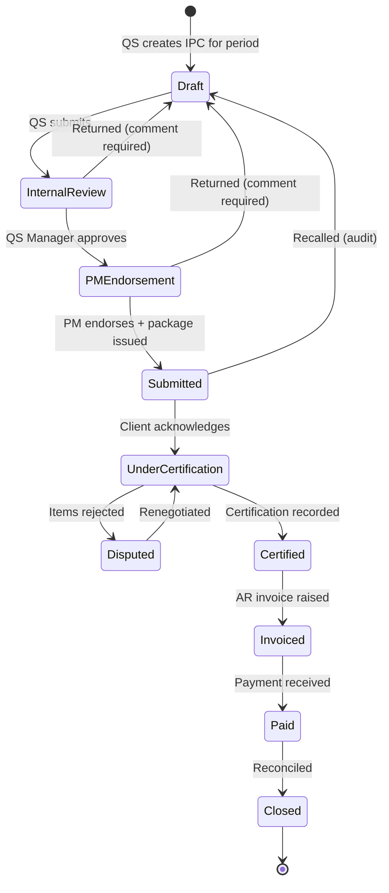

# 03 — Workflow Diagram
**Module:** 21 — IPC / Progress Claim
**Doc Code:** DCOS-MOD21-WF-001 | **Rev:** R0 | **Status:** Draft

---

## 1. Status List

```
Draft
→ Internal Review        (QS Manager)
→ PM Endorsement
→ Submitted              (to client/consultant)
→ Under Certification
→ Certified              (client values recorded)
→ Invoiced               (AR invoice raised in Accounting)
→ Paid / Partially Paid
→ Closed
```

Rejection / return paths:
```
Internal Review  → Returned to Draft        (with comment)
PM Endorsement   → Returned to Draft        (with comment)
Submitted        → Recalled to Draft        (internal recall, audit-logged)
Under Certification → Disputed              (client rejects items → negotiation
                                             → re-certify or carry to next IPC)
```

## 2. Flow (Mermaid)



## 3. Swimlane Responsibilities

| Step | QS Engineer | QS Manager | PM | Client/PMC | Accountant |
|---|---|---|---|---|---|
| 1. Create draft, measure quantities | **R** | C | I | – | – |
| 2. Add VOs, verify retention/advance | **R** | C | – | – | – |
| 3. Internal review | C | **R/A** | I | – | – |
| 4. Endorsement | I | C | **A** | – | – |
| 5. Submit package | **R** | I | I | I | – |
| 6. Certification entry | **R** (records) | C | I | **A** (decides) | I |
| 7. AR invoice | I | I | I | – | **R** |
| 8. Payment match + close | I | C | I | – | **R** |

R = Responsible, A = Accountable, C = Consulted, I = Informed

## 4. Timing Rules

| Event | Rule |
|---|---|
| IPC cut-off | 25th of month (configurable per project) |
| Internal review SLA | 1 working day |
| PM endorsement SLA | 1 working day |
| Submission deadline | Per contract (e.g. last day of month) — time-bar alert |
| Certification follow-up | Reminder to QS if no certification after contract period (e.g. 14 days) |

## 5. Integration Triggers

| On status | System action |
|---|---|
| Submitted | Snapshot all lines; create controlled document in Document Control; start certification timer |
| Certified | Push certified value to Retention module (recompute balance); notify Accounting |
| Invoiced | Link AR invoice ID; update cumulative position |
| Paid | Update receivable aging; close loop on dashboard |
