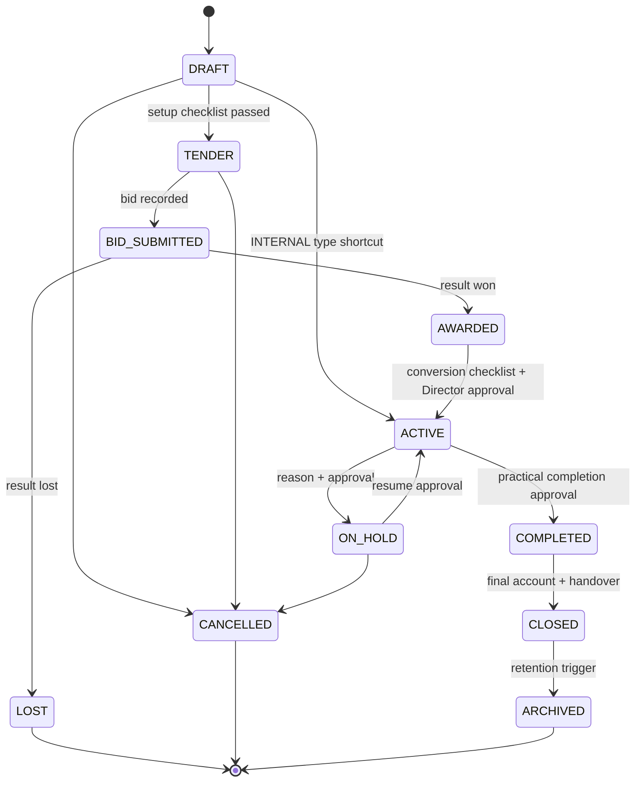
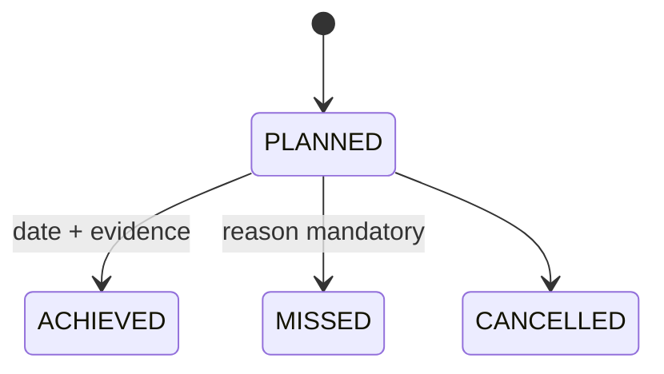
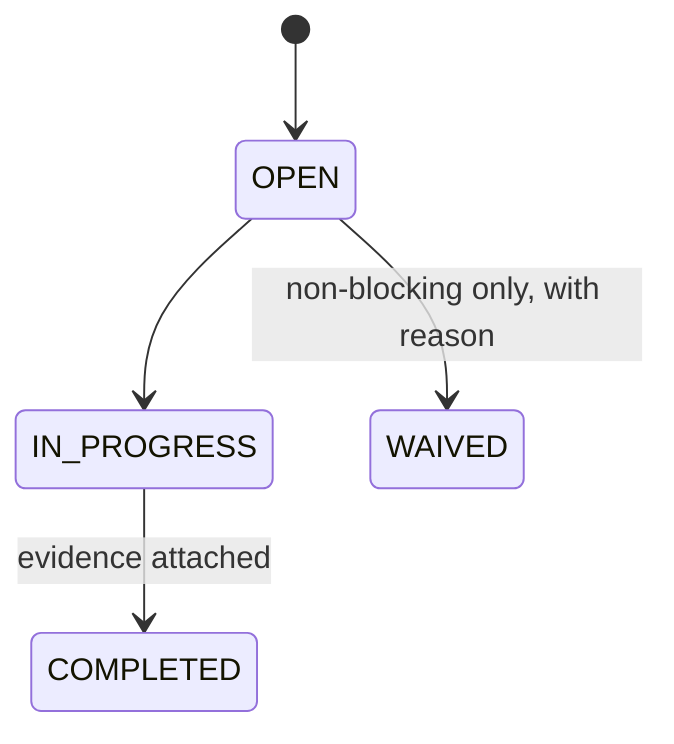

# DCOS — Project Setup Module
## 02 — Functional Specification

| Field | Detail |
|---|---|
| Document Code | DCOS-PRJ-FS-001 |
| Version | R1 |
| Module | 04-02 — Project Setup (Foundation Phase) |
| Author Persona | Senior System Architect |
| Status | Issued for Review |
| Depends On | DCOS-PRJ-BRD-001 |

---

## 1. Functional Overview

Project Setup is the context provider for the entire platform. It owns the project registry, tender lifecycle, award conversion, contract header, team roster, phases and gates, milestones, project calendar, numbering rules, and per-project settings. Every other DCOS module resolves project existence, status gates, team access, calendar, and record numbering through this module.

Consumers: WBS Management, Task Management, Document Control, Procurement, Account/Finance, BOQ, Planning & Scheduling, HR/Timesheet, RBAC Engine, Approval Workflow, Notification, Audit, Reporting, Mobile Field Application.

## 2. Functional Requirements

Priority: **M** = Must, **S** = Should, **C** = Could. Each FR lists emitted audit events and triggered notifications.

### FR Group A — Project Registry

| ID | Title | Description | Pri | Acceptance Criteria | Audit / Notify |
|---|---|---|---|---|---|
| PRJ-FR-001 | Project creation wizard | Multi-step wizard: classification → client → contract → team → calendar → numbering → review. Each step saves independently; project remains DRAFT until wizard completion. | M | Partial wizard state recoverable; DRAFT project excluded from portfolio KPIs | PROJECT_CREATED / Project created → Admin, Director |
| PRJ-FR-002 | Project code validation | Code unique per tenant, format configurable (default `P` + 3 digits). Duplicate attempt returns inline error with next-available suggestion. | M | Duplicate rejected at API and DB level (BR-PRJ-001) | — |
| PRJ-FR-003 | Project classification | Type (TENDER/AWARDED/INTERNAL), sector, contract-type intent, client link (stakeholder master), location, description. | M | Client must be an existing stakeholder of type Client | PROJECT_CREATED |
| PRJ-FR-004 | Portfolio list | Filterable/sortable list: status, phase, type, client, PM, value range; saved views per user; cursor pagination. | M | 1,000 projects load < 1.5 s | — |
| PRJ-FR-005 | Project search | Global search by code, name, client across assigned projects. | S | Results respect RBAC scoping | — |

### FR Group B — Tender Lifecycle

| ID | Title | Description | Pri | Acceptance Criteria | Audit / Notify |
|---|---|---|---|---|---|
| PRJ-FR-010 | Tender registration | Register opportunity: client, scope summary, submission deadline (date+time+timezone), bid bond requirement, estimated value. | M | Deadline stored UTC, displayed in project timezone | TENDER_REGISTERED |
| PRJ-FR-011 | Deadline countdown alerts | Configurable alerts before submission deadline (default 14/7/3/1 days). | M | Alerts fire per Notification Matrix | / Tender deadline → owner, Director |
| PRJ-FR-012 | Bid submission record | Record submitted bid value, date, transmittal reference. Status → BID_SUBMITTED. | M | Idempotent — duplicate submission blocked | BID_SUBMITTED |
| PRJ-FR-013 | Tender result — won | Record LOA reference and date; status → AWARDED; conversion checklist instantiated from template. | M | Checklist created atomically with transition | TENDER_WON / Bid won → Director, PM, QS, Admin |
| PRJ-FR-014 | Tender result — lost | Record losing price if known, winner if known, loss reason (coded list + free text); status → LOST, read-only. | M | Loss reason mandatory (BR-PRJ-019) | TENDER_LOST |
| PRJ-FR-015 | Win/loss analytics feed | Win rate by client, sector, and period exposed to Reporting module. | S | Matches Part 4.12 KPI definitions | — |

### FR Group C — Award Conversion

| ID | Title | Description | Pri | Acceptance Criteria | Audit / Notify |
|---|---|---|---|---|---|
| PRJ-FR-020 | Conversion checklist | Checklist instantiated from admin template on AWARDED. Blocking items: contract header, PM assigned, WBS root created, numbering rules configured. Non-blocking items configurable. | M | ACTIVE transition impossible with open blocking items (BR-PRJ-006) | CHECKLIST_ITEM_COMPLETED |
| PRJ-FR-021 | WBS root trigger | Completing the "WBS root" checklist item calls WBS module to create the project root node; failure keeps item open with error surfaced. | M | Compensation: no orphan state if WBS call fails | — |
| PRJ-FR-022 | Activation | Director approves AWARDED→ACTIVE; all modules unlocked for the project; team notified. | M | Approval routed via Workflow Engine; requester ≠ approver (BR-PRJ-024) | PROJECT_STATUS_CHANGED / stalled checklist → PM, Director |
| PRJ-FR-023 | Conversion lag tracking | Days from AWARDED to ACTIVE computed and reported vs 10-working-day target using project calendar. | S | Working days computed from project calendar | — |

### FR Group D — Status & Phase Management

| ID | Title | Description | Pri | Acceptance Criteria | Audit / Notify |
|---|---|---|---|---|---|
| PRJ-FR-030 | Status transition engine | Enforce the canonical transition map with guards; every transition writes status history (from, to, actor, reason, timestamp). | M | Disallowed transition → 409 with guard reason | PROJECT_STATUS_CHANGED + specific event |
| PRJ-FR-031 | Hold / resume | ON_HOLD requires reason + Director approval; blocks new record creation platform-wide via project gate; resume restores. | M | Gate consulted by Task/Doc/Procurement modules (BR-PRJ-012/013) | PROJECT_ON_HOLD, PROJECT_RESUMED / team notified |
| PRJ-FR-032 | Completion / closure | COMPLETED (practical completion) with PM request + Director approval; CLOSED requires final-account and handover confirmations. | M | CLOSED = read-only except DLP (BR-PRJ-014/015/016) | PROJECT_COMPLETED, PROJECT_CLOSED |
| PRJ-FR-033 | Cancellation | CANCELLED from permitted statuses with mandatory reason + Director approval; record read-only. | M | BR-PRJ-017 | PROJECT_CANCELLED |
| PRJ-FR-034 | Archival | CLOSED→ARCHIVED per retention trigger; admin-only visibility. | S | BR-PRJ-018 | PROJECT_ARCHIVED |
| PRJ-FR-035 | Phase & gate tracking | Phases INIT/PLAN/EXEC/MONI/CLOS per project with gate checklists from templates; gate pass recorded. | M | Gate items admin-configurable, never hard-coded | PHASE_GATE_PASSED |

### FR Group E — Team Roster

| ID | Title | Description | Pri | Acceptance Criteria | Audit / Notify |
|---|---|---|---|---|---|
| PRJ-FR-040 | Assign team member | Add user with project role and start date; optional end date; drives RBAC project access. | M | Access active only within effective dates (BR-PRJ-023) | TEAM_MEMBER_ASSIGNED |
| PRJ-FR-041 | Remove team member | End-date an assignment; access revoked from end date; open items owned by user flagged for reassignment. | M | Removal blocked if user is current PM | TEAM_MEMBER_REMOVED |
| PRJ-FR-042 | PM uniqueness | Exactly one active PM enforced at DB level (partial unique index). | M | Concurrent assignment attempts: one wins, one rejected (BR-PRJ-007) | — |
| PRJ-FR-043 | PM change | Atomic replace: end-date outgoing, start incoming, same timestamp; both PMs and Director notified. | M | No gap/overlap (BR-PRJ-008) | PM_CHANGED / PM change → old PM, new PM, Director |

### FR Group F — Contract Header

| ID | Title | Description | Pri | Acceptance Criteria | Audit / Notify |
|---|---|---|---|---|---|
| PRJ-FR-050 | Contract creation | Type (canonical list), original value ≥ 0, currency (master), commencement/completion dates, DLP months, retention % reference, key clause references. | M | One contract header per project (head contract) | CONTRACT_ADDED |
| PRJ-FR-051 | Contract revision | Value/date changes recorded as revisions with mandatory reason and reference (e.g. VO summary); original never overwritten. Current value = original + Σ revisions. | M | BR-PRJ-009 | CONTRACT_REVISED (High severity) |
| PRJ-FR-052 | Commercial read model | Expose original value, revisions, current value, currency, dates to BOQ/Finance/Reporting. | M | Read-only contract; consumers never write | — |
| PRJ-FR-053 | Currency lock | Currency immutable after first financial record on project. | M | BR-PRJ-010 | — |

### FR Group G — Milestones

| ID | Title | Description | Pri | Acceptance Criteria | Audit / Notify |
|---|---|---|---|---|---|
| PRJ-FR-060 | Milestone CRUD | Types CONTRACTUAL/INTERNAL/PAYMENT/HANDOVER/AUTHORITY; due date mandatory; LD-exposure flag on contractual. | M | BR-PRJ-020 | MILESTONE_CREATED |
| PRJ-FR-061 | Due alerts | 14/7/1-day alerts for contractual milestones; configurable for others. | M | BR-PRJ-021 | / milestone due → PM, Director, QS |
| PRJ-FR-062 | Achieve / miss | Achieved with date and evidence link; missed requires reason; contractual miss raises Critical alert. | M | MISSED reason mandatory | MILESTONE_ACHIEVED, MILESTONE_MISSED / Critical on contractual miss |

### FR Group H — Calendar

| ID | Title | Description | Pri | Acceptance Criteria | Audit / Notify |
|---|---|---|---|---|---|
| PRJ-FR-070 | Working pattern | Working days and hours per project, defaulted from company calendar, overridable. | M | Changes prospective only (BR-PRJ-022) | CALENDAR_UPDATED |
| PRJ-FR-071 | Project holidays | Project-specific non-working days added/removed; consumed by Planning and HR. | M | Company holidays inherited, individually overridable | HOLIDAY_ADDED |

### FR Group I — Numbering Rules

| ID | Title | Description | Pri | Acceptance Criteria | Audit / Notify |
|---|---|---|---|---|---|
| PRJ-FR-080 | Pattern builder | Per record type (DWG, RFI, TRN, PR, PO, …) build patterns from tokens with live preview. | M | Invalid token combinations rejected with hint | NUMBERING_RULE_CREATED |
| PRJ-FR-081 | Number resolution service | `resolveNumber(project, record_type, context)` returns next formatted number; concurrency-safe, never cached. | M | 50 parallel requests → zero duplicates | — |
| PRJ-FR-082 | Lock on first use | Pattern immutable after first number issued; lock badge in UI; unlock impossible (new record type rule required instead). | M | BR-PRJ-011 | NUMBERING_RULE_LOCKED / DC + PM notified |

### FR Group J — Settings & Dashboard

| ID | Title | Description | Pri | Acceptance Criteria | Audit / Notify |
|---|---|---|---|---|---|
| PRJ-FR-090 | Project settings | Key-value overrides: retention % default, approval chain selection, notification rule references, timezone. | M | Settings versioned via audit before/after | PROJECT_SETTING_CHANGED |
| PRJ-FR-091 | Setup completeness widget | % complete from checklist state, with direct links to open items. | S | Matches checklist source of truth | — |
| PRJ-FR-092 | Portfolio dashboard | Projects by status/phase, pipeline value by status, win rate, mobilisation lag, milestone on-time rate. | M | Matches KPI definitions | — |

## 3. Status Machines

### 3.1 Project Status

### 3.2 Milestone Status

### 3.3 Checklist Item Status

## 4. Validation Rules

| Field | Rule |
|---|---|
| project_code | Unique per tenant; pattern per admin config; immutable after ACTIVE |
| project_name | Required, 3–150 chars |
| client_id | Must reference stakeholder of type Client (except INTERNAL) |
| submission_deadline | Future datetime at registration; timezone-aware |
| original_value | ≥ 0; decimal(18,2) |
| currency | FK to currency master; locked per PRJ-FR-053 |
| milestone.due_date | Required; contractual milestones require LD flag decision |
| team.start_date/end_date | end ≥ start; PM assignment cannot leave a coverage gap |
| numbering pattern | Must include {SEQ:n}; tokens from canonical token list only |

## 5. Error and Edge Cases

| Case | Behaviour |
|---|---|
| Duplicate project code race | DB unique constraint wins; API returns 409 with next-available suggestion |
| PM user deactivated mid-project | System flags project "PM required"; Director notified Critical; status changes blocked until PM replaced |
| ON_HOLD with approvals in flight | In-flight approvals complete; new submissions blocked |
| Cancellation with committed cost | Warning displays committed value from Procurement read model; cancellation proceeds with acknowledgment recorded |
| WBS root creation fails at conversion | Checklist item stays open; error shown; retry idempotent |
| Tender deadline across timezone | Stored UTC; alerts computed in project timezone |
| Numbering resolve during deploy | Advisory-lock scope guarantees no duplicate even across instances |

## 6. Non-Functional Requirements

| Requirement | Target |
|---|---|
| Portfolio list (1,000 projects) | < 1.5 s |
| Wizard step save | < 500 ms |
| Number resolution under contention | < 200 ms |
| Status transition | < 1 s including gate evaluation |
| All state-changing writes audited | 100%, append-only |
| Tenant isolation | RLS on every table; cross-tenant tests in CI |

## 7. Change Log

| Version | Date | Change | Author |
|---|---|---|---|
| R1 | 2026-08 | Initial issue | System Architect |
