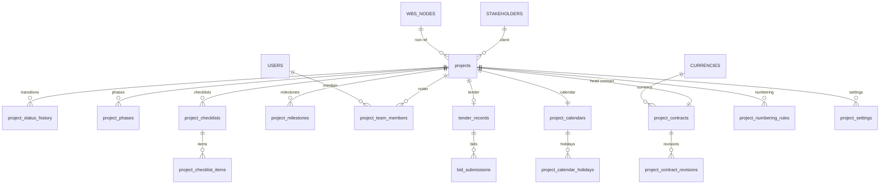

# DCOS — Project Setup Module
## 04 — Database Schema

| Field | Detail |
|---|---|
| Document Code | DCOS-PRJ-DB-001 |
| Version | R1 |
| Module | 04-02 — Project Setup (Foundation Phase) |
| Author Persona | Lead Database Architect |
| Status | Issued for Review |
| Target | PostgreSQL 15 on Supabase, RLS enforced |
| Depends On | DCOS-PRJ-FS-001, DCOS-PRJ-UC-001 |

**Conventions:** every table carries `id uuid PK default gen_random_uuid()`, `tenant_id uuid NOT NULL`, `created_at timestamptz default now()`, `created_by uuid`, `updated_at timestamptz`, `updated_by uuid`. These are shown once in DDL and omitted from column tables for brevity. Soft delete via `is_archived boolean default false` where noted — never hard delete (BR-PRJ-018).

**RLS (applied to all 15 tables):**

```sql
alter table {table} enable row level security;

create policy tenant_isolation on {table}
  using (tenant_id = (auth.jwt() ->> 'tenant_id')::uuid)
  with check (tenant_id = (auth.jwt() ->> 'tenant_id')::uuid);
```

---

## 1. ERD



`STAKEHOLDERS`, `USERS`, `CURRENCIES`, `WBS_NODES` are external entities owned by other modules.

---

## 2. Tables

### 2.1 `projects`

Project master registry.

| Column | Type | Null | Default | Description |
|---|---|---|---|---|
| project_code | text | no | — | Unique per tenant (BR-PRJ-001) |
| project_name | text | no | — | 3–150 chars |
| project_type | text | no | — | TENDER / AWARDED / INTERNAL |
| status | text | no | 'DRAFT' | Canonical status list |
| client_id | uuid | yes | — | FK stakeholders; null only for INTERNAL |
| sector | text | yes | — | Building, infrastructure, industrial… |
| location | text | yes | — | Site address / city |
| description | text | yes | — | Scope summary |
| timezone | text | no | 'Asia/Phnom_Penh' | Deadline/alert computation |
| current_phase | text | yes | — | INIT/PLAN/EXEC/MONI/CLOS |
| project_manager_id | uuid | yes | — | Denormalised current PM (maintained by trigger from roster) |
| wbs_root_id | uuid | yes | — | Set when WBS root created |
| awarded_at | timestamptz | yes | — | For mobilisation-lag KPI |
| activated_at | timestamptz | yes | — | — |
| is_archived | boolean | no | false | Soft delete |

```sql
create table projects (
  id uuid primary key default gen_random_uuid(),
  tenant_id uuid not null,
  project_code text not null,
  project_name text not null check (char_length(project_name) between 3 and 150),
  project_type text not null check (project_type in ('TENDER','AWARDED','INTERNAL')),
  status text not null default 'DRAFT' check (status in
    ('DRAFT','TENDER','BID_SUBMITTED','LOST','AWARDED','ACTIVE',
     'ON_HOLD','COMPLETED','CLOSED','ARCHIVED','CANCELLED')),
  client_id uuid,
  sector text,
  location text,
  description text,
  timezone text not null default 'Asia/Phnom_Penh',
  current_phase text check (current_phase in ('INIT','PLAN','EXEC','MONI','CLOS')),
  project_manager_id uuid,
  wbs_root_id uuid,
  awarded_at timestamptz,
  activated_at timestamptz,
  is_archived boolean not null default false,
  created_at timestamptz not null default now(),
  created_by uuid,
  updated_at timestamptz,
  updated_by uuid,
  constraint uq_projects_code unique (tenant_id, project_code),
  constraint chk_client_required check (project_type = 'INTERNAL' or client_id is not null or status = 'DRAFT')
);
create index idx_projects_tenant_status on projects (tenant_id, status) where not is_archived;
create index idx_projects_pm on projects (tenant_id, project_manager_id);
```

*Index justification:* portfolio list filters on status (most frequent query); PM index serves "my projects" scoping.

### 2.2 `project_status_history`

Append-only transition log.

| Column | Type | Null | Description |
|---|---|---|---|
| project_id | uuid | no | FK projects |
| status_from | text | yes | Null on creation |
| status_to | text | no | — |
| reason | text | yes | Mandatory for HOLD/CANCEL/MISS paths (app-enforced) |
| approved_by | uuid | yes | Approver when workflow applies |
| transitioned_at | timestamptz | no | default now() |

```sql
create table project_status_history (
  id uuid primary key default gen_random_uuid(),
  tenant_id uuid not null,
  project_id uuid not null references projects(id),
  status_from text,
  status_to text not null,
  reason text,
  approved_by uuid,
  transitioned_at timestamptz not null default now(),
  created_at timestamptz not null default now(),
  created_by uuid
);
create index idx_psh_project on project_status_history (project_id, transitioned_at desc);
revoke update, delete on project_status_history from authenticated; -- append-only
```

### 2.3 `project_phases`

| Column | Type | Null | Description |
|---|---|---|---|
| project_id | uuid | no | FK |
| phase_code | text | no | INIT/PLAN/EXEC/MONI/CLOS |
| gate_status | text | no | OPEN / PASSED |
| gate_passed_at | timestamptz | yes | — |
| gate_passed_by | uuid | yes | — |

```sql
create table project_phases (
  id uuid primary key default gen_random_uuid(),
  tenant_id uuid not null,
  project_id uuid not null references projects(id),
  phase_code text not null check (phase_code in ('INIT','PLAN','EXEC','MONI','CLOS')),
  gate_status text not null default 'OPEN' check (gate_status in ('OPEN','PASSED')),
  gate_passed_at timestamptz,
  gate_passed_by uuid,
  created_at timestamptz not null default now(), created_by uuid,
  updated_at timestamptz, updated_by uuid,
  constraint uq_phase unique (project_id, phase_code)
);
```

### 2.4 `project_checklists`

Checklist instances (gate checklists and the award conversion checklist).

```sql
create table project_checklists (
  id uuid primary key default gen_random_uuid(),
  tenant_id uuid not null,
  project_id uuid not null references projects(id),
  checklist_type text not null check (checklist_type in ('CONVERSION','GATE','SETUP')),
  phase_code text,
  template_code text not null,           -- admin template it was instantiated from
  status text not null default 'OPEN' check (status in ('OPEN','COMPLETED')),
  completed_at timestamptz,
  created_at timestamptz not null default now(), created_by uuid,
  updated_at timestamptz, updated_by uuid
);
create index idx_chk_project on project_checklists (project_id, checklist_type);
```

### 2.5 `project_checklist_items`

```sql
create table project_checklist_items (
  id uuid primary key default gen_random_uuid(),
  tenant_id uuid not null,
  checklist_id uuid not null references project_checklists(id),
  item_code text not null,               -- e.g. CONTRACT_HEADER, PM_ASSIGNED, WBS_ROOT, NUMBERING
  item_label text not null,
  is_blocking boolean not null default false,
  status text not null default 'OPEN' check (status in ('OPEN','IN_PROGRESS','COMPLETED','WAIVED')),
  evidence_ref text,                     -- link to record/document proving completion
  waive_reason text,
  completed_at timestamptz,
  completed_by uuid,
  sort_order int not null default 0,
  created_at timestamptz not null default now(), created_by uuid,
  updated_at timestamptz, updated_by uuid,
  constraint chk_waive_nonblocking check (status <> 'WAIVED' or is_blocking = false),
  constraint chk_waive_reason check (status <> 'WAIVED' or waive_reason is not null)
);
create index idx_chk_items on project_checklist_items (checklist_id, status);
```

*Blocking-gate enforcement:* the ACTIVE transition guard (application layer + `checkProjectGate`) verifies no row where `is_blocking and status not in ('COMPLETED')` for the CONVERSION checklist.

### 2.6 `project_milestones`

```sql
create table project_milestones (
  id uuid primary key default gen_random_uuid(),
  tenant_id uuid not null,
  project_id uuid not null references projects(id),
  milestone_type text not null check (milestone_type in
    ('CONTRACTUAL','INTERNAL','PAYMENT','HANDOVER','AUTHORITY')),
  title text not null,
  due_date date not null,
  ld_exposure boolean not null default false,
  clause_ref text,
  status text not null default 'PLANNED' check (status in ('PLANNED','ACHIEVED','MISSED','CANCELLED')),
  achieved_date date,
  evidence_ref text,
  missed_reason text,
  created_at timestamptz not null default now(), created_by uuid,
  updated_at timestamptz, updated_by uuid,
  constraint chk_missed_reason check (status <> 'MISSED' or missed_reason is not null),
  constraint chk_achieved_date check (status <> 'ACHIEVED' or achieved_date is not null)
);
create index idx_ms_due on project_milestones (tenant_id, due_date) where status = 'PLANNED';
```

*Index justification:* the alert scheduler scans PLANNED milestones by due date daily.

### 2.7 `project_team_members`

```sql
create table project_team_members (
  id uuid primary key default gen_random_uuid(),
  tenant_id uuid not null,
  project_id uuid not null references projects(id),
  user_id uuid not null,
  project_role text not null,            -- PM, DISCIPLINE_MANAGER, ENGINEER, QS, DC, ...
  start_date date not null,
  end_date date,
  created_at timestamptz not null default now(), created_by uuid,
  updated_at timestamptz, updated_by uuid,
  constraint chk_dates check (end_date is null or end_date >= start_date)
);
-- BR-PRJ-007: exactly one active PM per project
create unique index uq_one_active_pm
  on project_team_members (project_id)
  where project_role = 'PM' and end_date is null;
create index idx_team_user on project_team_members (tenant_id, user_id) where end_date is null;
```

### 2.8 `project_contracts`

Head contract header — one per project.

```sql
create table project_contracts (
  id uuid primary key default gen_random_uuid(),
  tenant_id uuid not null,
  project_id uuid not null references projects(id),
  contract_type text not null check (contract_type in
    ('LUMP_SUM','UNIT_RATE','DESIGN_BUILD','COST_PLUS','EPC','TURNKEY','NSC')),
  original_value numeric(18,2) not null check (original_value >= 0),
  currency_code text not null,           -- FK currencies (Multi-Currency module)
  commencement_date date,
  completion_date date,
  dlp_months int check (dlp_months >= 0),
  retention_percent numeric(5,2),
  clause_refs jsonb,
  currency_locked boolean not null default false,  -- set true on first financial record
  created_at timestamptz not null default now(), created_by uuid,
  updated_at timestamptz, updated_by uuid,
  constraint uq_head_contract unique (project_id)
);
```

### 2.9 `project_contract_revisions`

Original value never overwritten (BR-PRJ-009); current value = original + Σ approved deltas.

```sql
create table project_contract_revisions (
  id uuid primary key default gen_random_uuid(),
  tenant_id uuid not null,
  contract_id uuid not null references project_contracts(id),
  revision_no int not null,
  value_delta numeric(18,2) not null default 0,
  new_completion_date date,
  reason text not null,
  reference text,                        -- e.g. VO summary ref
  approved_by uuid,
  approved_at timestamptz,
  created_at timestamptz not null default now(), created_by uuid,
  updated_at timestamptz, updated_by uuid,
  constraint uq_rev unique (contract_id, revision_no)
);
```

### 2.10 `tender_records`

```sql
create table tender_records (
  id uuid primary key default gen_random_uuid(),
  tenant_id uuid not null,
  project_id uuid not null references projects(id),
  scope_summary text,
  estimated_value numeric(18,2),
  submission_deadline timestamptz not null,
  bond_required boolean not null default false,
  bond_details text,
  result text check (result in ('WON','LOST')),
  result_reference text,                 -- LOA ref
  result_date date,
  loss_reason_code text,
  loss_notes text,
  winner_name text,
  winning_price numeric(18,2),
  created_at timestamptz not null default now(), created_by uuid,
  updated_at timestamptz, updated_by uuid,
  constraint uq_tender unique (project_id),
  constraint chk_loss_reason check (result <> 'LOST' or loss_reason_code is not null)
);
create index idx_tender_deadline on tender_records (tenant_id, submission_deadline) where result is null;
```

### 2.11 `bid_submissions`

```sql
create table bid_submissions (
  id uuid primary key default gen_random_uuid(),
  tenant_id uuid not null,
  tender_id uuid not null references tender_records(id),
  submitted_value numeric(18,2) not null,
  submitted_at timestamptz not null,
  transmittal_ref text,
  created_at timestamptz not null default now(), created_by uuid,
  constraint uq_bid unique (tender_id)   -- idempotent single submission (PRJ-FR-012)
);
```

### 2.12 `project_calendars`

```sql
create table project_calendars (
  id uuid primary key default gen_random_uuid(),
  tenant_id uuid not null,
  project_id uuid not null references projects(id),
  working_days jsonb not null default '["MON","TUE","WED","THU","FRI","SAT"]',
  work_start time not null default '07:30',
  work_end time not null default '17:00',
  inherits_company_holidays boolean not null default true,
  created_at timestamptz not null default now(), created_by uuid,
  updated_at timestamptz, updated_by uuid,
  constraint uq_calendar unique (project_id)
);
```

### 2.13 `project_calendar_holidays`

```sql
create table project_calendar_holidays (
  id uuid primary key default gen_random_uuid(),
  tenant_id uuid not null,
  calendar_id uuid not null references project_calendars(id),
  holiday_date date not null,
  holiday_name text not null,
  is_override_removal boolean not null default false, -- true = company holiday made a working day
  created_at timestamptz not null default now(), created_by uuid,
  constraint uq_holiday unique (calendar_id, holiday_date)
);
```

### 2.14 `project_numbering_rules`

```sql
create table project_numbering_rules (
  id uuid primary key default gen_random_uuid(),
  tenant_id uuid not null,
  project_id uuid not null references projects(id),
  record_type text not null,             -- DWG, RFI, TRN, PR, PO, ...
  pattern text not null,                 -- e.g. {PROJECT}-{DISCIPLINE}-{TYPE}-{BUILDING}-{LEVEL}-{SEQ:3}-R{REV}
  next_seq int not null default 1,
  is_locked boolean not null default false,
  locked_at timestamptz,
  created_at timestamptz not null default now(), created_by uuid,
  updated_at timestamptz, updated_by uuid,
  constraint uq_numbering unique (project_id, record_type),
  constraint chk_pattern_seq check (pattern like '%{SEQ:%')
);
```

**Concurrency-safe number issuance (PRJ-FR-081).** Sequence state lives in the rule row; issuance takes a row lock so parallel requests serialise without duplicates, across all app instances:

```sql
-- inside a single transaction, called by the resolution service
select id, pattern, next_seq
from project_numbering_rules
where project_id = $1 and record_type = $2
for update;                              -- row lock = serialisation point

update project_numbering_rules
set next_seq = next_seq + 1,
    is_locked = true,
    locked_at = coalesce(locked_at, now())
where id = $rule_id;
```

An advisory-lock alternative (`pg_advisory_xact_lock(hashtext(project_id||record_type))`) is acceptable but the `FOR UPDATE` row lock is simpler and sufficient. Numbers are **never cached** and never issued outside this transaction.

### 2.15 `project_settings`

```sql
create table project_settings (
  id uuid primary key default gen_random_uuid(),
  tenant_id uuid not null,
  project_id uuid not null references projects(id),
  setting_key text not null,             -- e.g. retention_default, approval_chain, notif_profile
  setting_value jsonb not null,
  created_at timestamptz not null default now(), created_by uuid,
  updated_at timestamptz, updated_by uuid,
  constraint uq_setting unique (project_id, setting_key)
);
```

---

## 3. Seed Data

```sql
-- Conversion checklist template (referenced by template_code)
insert into admin_checklist_templates (template_code, checklist_type, items) values
('CONVERSION_DEFAULT','CONVERSION','[
  {"item_code":"CONTRACT_HEADER","label":"Contract header recorded","blocking":true,"sort":1},
  {"item_code":"PM_ASSIGNED","label":"Project Manager assigned","blocking":true,"sort":2},
  {"item_code":"WBS_ROOT","label":"WBS root node created","blocking":true,"sort":3},
  {"item_code":"NUMBERING","label":"Numbering rules configured","blocking":true,"sort":4},
  {"item_code":"TEAM_CORE","label":"Core team assigned","blocking":false,"sort":5},
  {"item_code":"CALENDAR","label":"Project calendar confirmed","blocking":false,"sort":6},
  {"item_code":"KICKOFF","label":"Kick-off meeting held","blocking":false,"sort":7}
]'::jsonb);

-- Default numbering patterns (copied into project on creation)
insert into admin_numbering_defaults (record_type, pattern) values
('DWG','{PROJECT}-{DISCIPLINE}-DWG-{BUILDING}-{LEVEL}-{SEQ:3}-R{REV}'),
('RFI','{PROJECT}-RFI-{SEQ:4}'),
('TRN','{PROJECT}-TRN-{YYYY}-{SEQ:4}'),
('PR' ,'{PROJECT}-PR-{YYYY}{MM}-{SEQ:4}'),
('PO' ,'{PROJECT}-PO-{YYYY}{MM}-{SEQ:4}');

-- Loss reason codes
insert into admin_code_lists (list_code, code, label) values
('TENDER_LOSS','PRICE','Price too high'),
('TENDER_LOSS','TECHNICAL','Technical non-compliance'),
('TENDER_LOSS','RELATIONSHIP','Competitor relationship'),
('TENDER_LOSS','WITHDRAWN','Tender withdrawn by client'),
('TENDER_LOSS','OTHER','Other');
```

*(Admin tables `admin_checklist_templates`, `admin_numbering_defaults`, `admin_code_lists` are owned by Admin Configuration — shown for seed completeness only. Recorded in Change Log.)*

---

## 4. Migration Ordering

| Order | Migration | Reason |
|---|---|---|
| 1 | `projects` | Everything references it |
| 2 | `project_status_history`, `project_calendars`, `project_settings` | Direct children |
| 3 | `project_calendar_holidays`, `project_phases`, `project_checklists` → `project_checklist_items` | Parent-first |
| 4 | `project_team_members` (with partial unique PM index) | Needs `users` from Auth module |
| 5 | `project_contracts` → `project_contract_revisions` | Needs currency master |
| 6 | `tender_records` → `bid_submissions` | — |
| 7 | `project_numbering_rules` | Must exist **before** Document/RFI/Procurement modules migrate — they FK the resolver contract |

WBS, Task, and Document module migrations must run **after** this module: they all FK `projects.id` and consume the numbering resolver.

## 5. Change Log

| Version | Date | Change | Author |
|---|---|---|---|
| R1 | 2026-08 | Initial issue. Referenced three Admin Configuration tables in seed data (owned by Admin module, not added to canonical 15). | DB Architect |
