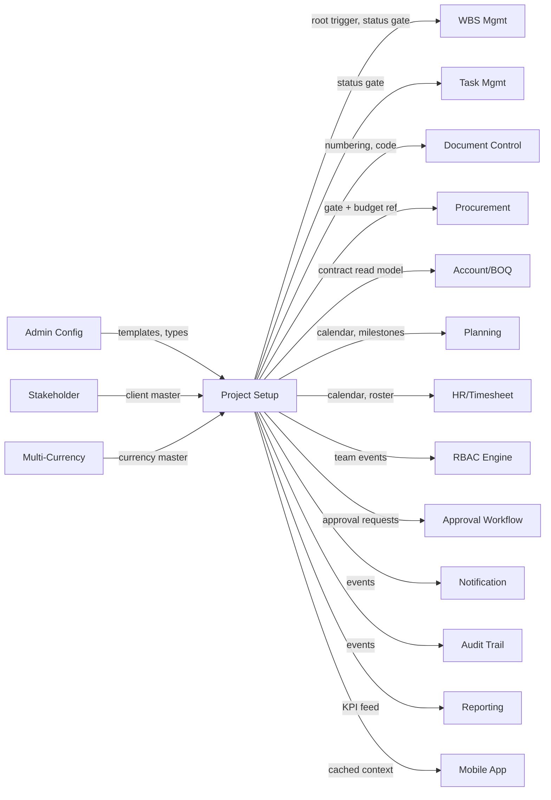

# DCOS — Project Setup Module
## 05 — Integration Specification

| Field | Detail |
|---|---|
| Document Code | DCOS-PRJ-INT-001 |
| Version | R1 |
| Module | 04-02 — Project Setup (Foundation Phase) |
| Author Persona | Senior System Architect |
| Status | Issued for Review |
| Depends On | DCOS-PRJ-FS-001, DCOS-PRJ-DB-001 |

---

## 1. Integration Philosophy

Project Setup is the **context provider** for the whole platform. Every module resolves four things through it: does the project exist, what status gate applies, who is on the team, and what number the next record gets. No module holds its own copy of project status or numbering state — they call this module's resolution services or subscribe to its events.

Two contract styles are offered:

1. **Synchronous resolution services** — low-latency reads (`resolveProjectContext`, `checkProjectGate`, `resolveNumber`) for request-path decisions.
2. **Event bus** — asynchronous notifications of project lifecycle changes for modules that maintain derived state (RBAC cache, dashboards, mobile cache).

## 2. Integration Map



| Direction | Module | Contract Summary |
|---|---|---|
| Inbound | Stakeholder Setup | `client_id` FK validation; client-type check at project creation |
| Inbound | Admin Configuration | Phase templates, checklist templates, numbering defaults, code lists |
| Inbound | Multi-Currency | Currency master FK for `project_contracts.currency_code` |
| Outbound | WBS Management | Root-creation command; status gate consultation |
| Outbound | Task / Document / Procurement | `checkProjectGate` before create/submit; numbering resolution (Doc/Proc) |
| Outbound | Account/Finance, BOQ | Contract header read model; currency-lock callback |
| Outbound | Planning & Scheduling | Calendar + milestone feed |
| Outbound | HR / Timesheet | Working-day calendar; roster membership validation |
| Outbound | RBAC Engine | Team roster events drive project-access dimension |
| Outbound | Approval Workflow | Hold/complete/cancel/activation chains |
| Outbound | Notification / Audit | Events per Part 4.10/4.11 canonical lists |
| Outbound | Mobile App | Cached project list + calendar, offline-safe |

## 3. Inbound Integrations

### 3.1 Stakeholder Setup

- **Trigger:** project creation/edit with `client_id`.
- **Contract:** synchronous `GET stakeholder/:id` → must return `stakeholder_type = 'CLIENT'` and `status = 'ACTIVE'`. Failure → 422 `CLIENT_INVALID`.
- **Idempotency:** read-only.

### 3.2 Admin Configuration

- **Trigger:** project creation (copy numbering defaults), AWARDED transition (instantiate `CONVERSION_DEFAULT` checklist template), phase creation (gate templates).
- **Contract:** templates are **copied**, not referenced live — later template edits never mutate existing projects.

### 3.3 Multi-Currency

- **Trigger:** contract header save.
- **Contract:** `currency_code` must exist and be active. Finance module calls back `POST /projects/:id/contract/lock-currency` on first financial record (sets `currency_locked = true`, enforcing BR-PRJ-010).

## 4. Outbound Integrations

### 4.1 WBS Management

| Aspect | Detail |
|---|---|
| Trigger | Checklist item `WBS_ROOT` completion attempt |
| Style | Synchronous command `POST wbs/roots {project_id, project_code, project_name}` |
| Idempotency | Key = `project_id`; WBS returns existing root if already created |
| Failure | Checklist item stays OPEN; error surfaced; retry safe |
| Reverse gate | WBS consults `checkProjectGate(project_id,'wbs.create')` — blocked unless status ACTIVE |

### 4.2 Task / Document / Procurement Gates

All three call `checkProjectGate` before record creation:

| Project Status | task.create | doc.create | pr.create |
|---|---|---|---|
| ACTIVE | allow | allow | allow |
| ON_HOLD | block | block | block |
| COMPLETED | block (except DLP module) | allow (handover docs) | block |
| CLOSED | block | block | block |
| TENDER/BID_SUBMITTED | block | allow (tender docs) | block |
| Others | block | block | block |

### 4.3 Document Control — Numbering

Document Control never formats numbers itself. On issue, it calls `resolveNumber`; the response is final and unique. Renumbering is impossible by contract (BR-PRJ-011).

### 4.4 Account/Finance & BOQ — Contract Read Model

`GET /projects/:id/contract` returns original value, revision list, computed current value, currency, dates. Consumers are read-only; revisions enter only through this module's revision workflow.

### 4.5 RBAC Engine

Team roster events (`TEAM_MEMBER_ASSIGNED/REMOVED`, `PM_CHANGED`) update the project-access dimension of the permission formula. RBAC caches roster with 60 s TTL; events invalidate immediately.

### 4.6 Approval Workflow Engine

| Flow | Chain (default, admin-configurable) |
|---|---|
| AWARDED → ACTIVE | PM (request) → Project Director (approve) |
| ACTIVE → ON_HOLD / resume | PM → Director |
| ACTIVE → COMPLETED | PM → Director |
| Cancel (any) | Requester → Director |
| Contract revision | QS → Director |

Segregation of duties (BR-PRJ-024) enforced by the Workflow Engine: requester excluded from approver resolution.

### 4.7 Mobile Field Application

Mobile caches per user: assigned project list (id, code, name, status), calendar, and current phase. Cache manifest version bumps on any `PROJECT_*` event; offline devices reconcile on sync. Status gates are **re-checked server-side on sync** — an offline-created task against a project that went ON_HOLD is rejected with conflict record.

## 5. Project Context Resolution Service

Central API other modules call. Base path `/api/v1/projects`.

### 5.1 `resolveProjectContext(project_id)`

```
GET /projects/{id}/context
```

```json
{
  "project_id": "…",
  "project_code": "P014",
  "status": "ACTIVE",
  "current_phase": "EXEC",
  "timezone": "Asia/Phnom_Penh",
  "project_manager": {"user_id": "…", "name": "Sokha"},
  "team": [{"user_id": "…", "project_role": "ENGINEER", "start_date": "2026-03-19", "end_date": null}],
  "calendar": {"working_days": ["MON","TUE","WED","THU","FRI","SAT"], "work_start": "07:30", "work_end": "17:00"},
  "settings": {"retention_default": 5.0},
  "wbs_root_id": "…",
  "as_of": "2026-08-08T04:00:00Z"
}
```

**Caching:** cacheable 60 s. Invalidation events: any `PROJECT_*`, `TEAM_*`, `CALENDAR_*`, `PROJECT_SETTING_CHANGED`.

### 5.2 `checkProjectGate(project_id, action)`

```
GET /projects/{id}/gate?action=task.create
```

```json
{ "allowed": false, "reason": "PROJECT_ON_HOLD", "status": "ON_HOLD", "message": "Project is on hold since 2026-07-02" }
```

**Caching:** 10 s max; gate checks on financial actions are never cached.

### 5.3 `resolveNumber(project_id, record_type, context)`

```
POST /projects/{id}/numbering/resolve
{ "record_type": "DWG", "context": {"DISCIPLINE": "STR", "BUILDING": "B01", "LEVEL": "L05", "REV": "00"} }
```

```json
{ "number": "P014-STR-DWG-B01-L05-001-R00", "seq": 1, "rule_locked": true }
```

**Caching:** never. Transactional row lock per DCOS-PRJ-DB-001 §2.14. Idempotency key supported: same key returns same number without incrementing.

## 6. Event Bus Contract

Envelope for all events:

```json
{
  "event_id": "uuid",
  "event_code": "PROJECT_STATUS_CHANGED",
  "tenant_id": "uuid",
  "project_id": "uuid",
  "occurred_at": "ISO8601",
  "actor": {"user_id": "uuid", "role_snapshot": "PM"},
  "correlation_id": "uuid",
  "payload": { }
}
```

Payload examples:

```json
// PROJECT_STATUS_CHANGED
{"status_from": "AWARDED", "status_to": "ACTIVE", "reason": null, "approved_by": "uuid"}

// PM_CHANGED
{"outgoing_user_id": "uuid", "incoming_user_id": "uuid", "effective_at": "ISO8601"}

// CONTRACT_REVISED
{"contract_id": "uuid", "revision_no": 2, "value_delta": 250000.00, "currency": "USD", "reason": "VO-004 approved"}

// MILESTONE_MISSED
{"milestone_id": "uuid", "milestone_type": "CONTRACTUAL", "due_date": "2026-09-30", "missed_reason": "Client design change", "ld_exposure": true}
```

All Part 4.10 event codes are published. Consumers must be idempotent on `event_id`.

## 7. Failure Behaviour

| Concern | Rule |
|---|---|
| Idempotency | Status transitions and result recording accept `Idempotency-Key`; replays return the original outcome |
| Retry | Event delivery at-least-once, exponential backoff, DLQ after 5 attempts with Admin alert |
| WBS root saga | Activation is impossible until WBS root exists — there is deliberately **no** "activate then create root" path, so no compensation needed; the checklist is the saga coordinator |
| Downstream unavailability | Gate service outage → consuming modules must **fail closed** (block creation) and surface retry, never fail open |
| Clock | All timestamps UTC; deadline/alert computation in project timezone |

## 8. Change Log

| Version | Date | Change | Author |
|---|---|---|---|
| R1 | 2026-08 | Initial issue | System Architect |
